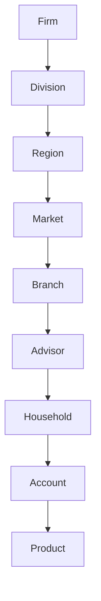
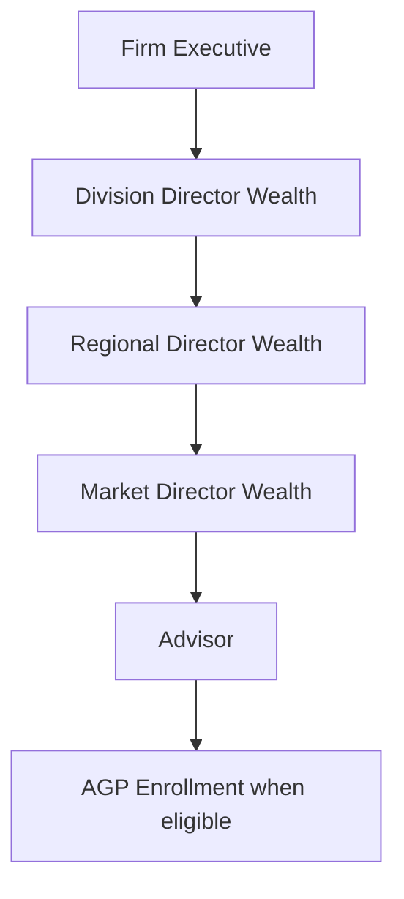

# iPerform Insights & Coaching — Complete Rebuild Specification

**Version:** 1.1  
**Date:** July 2, 2026  
**Status:** Implementation-ready rebuild baseline for the production-style functional simulation

> The uploaded TigerGraph GSQL remains authoritative for existing schema definitions. Prior analysis confirmed graph `iperform_insights_coaching_demo` with 42 vertices and 81 directed edges. This specification marks all additions and changes as explicit deltas; Story 1 must run schema reconciliation before loading data or compiling queries.

## 1. Purpose and Scope

Build a React-based, production-style functional simulation of iPerform Insights & Coaching. The application showcases hierarchy-aware wealth performance analytics and the complete agentic AI lifecycle: context retrieval, memory, feature engineering, embeddings, similarity, predictions, AI opportunities, recommendations, severity/impact, feedback, outcomes, learning and explainability. It is not a production release and shall not be represented as one.

### Rebuild principles

- Start from a clean repository; do not reuse broken generated packages.
- Completely avoid Streamlit.
- Use React/TypeScript frontend, FastAPI backend, TigerGraph graph, TigerGraph MCP plus REST/GSQL fallback.
- Persist every simulated intelligence artifact so the system can show how it works.
- Keep existing schema and proposed schema changes explicitly separated.
- Validate each layer before the next story begins.

## 2. Corrected Hierarchies

### Organizational hierarchy



### Management/persona hierarchy



## 3. Personas and Access

| Role | Code | Primary scope | Managed scope | Home | Responsibilities | Data access |
| --- | --- | --- | --- | --- | --- | --- |
| Firm Executive | EXEC | Firm | All divisions, regions, markets, branches, advisors | Executive Command Center | Firm performance, strategic growth, AGP outcomes, prediction and recommendation adoption, enterprise risk. | Aggregated firm data with authorized drilldown to all subordinate entities. |
| Division Director Wealth (DDW) | DDW | Division | Regional Directors and all subordinate regions, markets, branches, advisors | Division Command Center | Division revenue, RDW oversight, market performance, AGP program outcomes, coaching effectiveness. | Assigned division and all descendants. |
| Regional Director Wealth (RDW) | RDW | Region | Market Directors and all subordinate markets, branches, advisors | Regional Command Center | Regional performance, MDW oversight, market comparison, advisor risk, AGP milestone health. | Assigned region and all descendants. |
| Market Director Wealth (MDW) | MDW | Market | Branches and advisors in the assigned market | Market Command Center | Advisor performance, coaching queue, AGP advisor reviews, CRM follow-ups, opportunity execution. | Assigned market, branches, advisors, and related books of business. |
| Advisor | ADVISOR | Advisor | Own households, accounts, CRM pipeline, recommendations and outcomes | My Performance | Revenue growth, client service, CRM execution, recommendation actions, feedback and outcomes. | Own advisor record and related authorized client/book entities. |
| AGP Advisor | AGP_ADVISOR | Advisor + AGP Enrollment | Own 24-month AGP plan, milestones, KPIs, leads, referrals, opportunities and coaching | AGP Home | Progress toward 3-month milestones, KPI attainment, lead/referral completion and pipeline conversion. | Own advisor and AGP program records. |
| Compliance / Supervisor | COMPLIANCE | Assigned supervisory scope | AI artifacts, recommendation audit, guardrails and advisor action history | Compliance Review Queue | Review evidence, explanations, guardrail events, recommendations and action history. | Assigned organizational scope and audit artifacts. |
| Administrator / Operations | ADMIN | Platform | Users, role mappings, data jobs, APIs, configuration and health | Admin Console | Platform configuration, access assignments, data health and operational troubleshooting. | Platform metadata and permitted business data for support. |
| AI / Data Operations | AI_OPS | AI platform | Features, embeddings, model runs, agent traces, evaluations and drift | AI Operations | Run and inspect feature, embedding, prediction and evaluation pipelines. | AI artifacts and governed source data required for operations. |

## 4. Page and Navigation Catalog

| ID | Page | Group | Purpose | Roles |
| --- | --- | --- | --- | --- |
| ROLE-SELECT | Role Selection | Global | Select simulated identity, persona, default scope and optional comparison scope. | All |
| HOME-EXEC | Executive Command Center | Business | Firm KPIs, division comparison, critical opportunities, AGP and adoption summaries. | EXEC |
| HOME-DDW | Division Command Center | Business | Division KPIs, RDW/region performance, coaching and AGP summaries. | DDW |
| HOME-RDW | Regional Command Center | Business | Region KPIs, MDW/market comparison, advisor risks and AGP health. | RDW |
| HOME-MDW | Market Command Center | Business | Market and branch performance, advisor queue, CRM tasks and recommendations. | MDW |
| HOME-ADV | My Performance | Business | Advisor KPIs, trends, product mix, goals and actions. | ADVISOR,AGP_ADVISOR |
| HOME-AGP | AGP Home | Business | Current AGP month, active 3-month milestone, KPIs, leads, referrals, CRM opportunities and coaching. | AGP_ADVISOR,MDW,RDW,DDW |
| REV-INTEL | Revenue Intelligence | Business | LTM/YTD/monthly/quarterly/annual/custom analytics with hierarchy drilldown. | EXEC,DDW,RDW,MDW,ADVISOR |
| HIER-EXP | Hierarchy Explorer | Business | Firm to Division to Region to Market to Branch to Advisor navigation and scope comparison. | EXEC,DDW,RDW,MDW,ADMIN |
| ADV-360 | Advisor 360 | Business | Unified advisor, households, accounts, products, revenue, CRM, AGP and AI artifacts. | EXEC,DDW,RDW,MDW,ADVISOR,COMPLIANCE |
| BOOK | Book of Business | Business | Household/account/product holdings, revenue, growth potential and relationship activity. | MDW,ADVISOR,AGP_ADVISOR |
| AGP-PROGRAM | AGP Program & Cohorts | Business | 24-month program configuration, cohorts, aggregate milestone health and outcomes. | EXEC,DDW,RDW,MDW,ADMIN |
| AGP-MILESTONE | AGP Milestones & KPIs | Business | Milestones at months 3,6,9,12,15,18,21,24 with KPI target/actual/attainment. | DDW,RDW,MDW,AGP_ADVISOR |
| CRM-LEAD | CRM Leads & Referrals | Business | Pending/completed/converted/overdue leads and referrals, by AGP advisor and scope. | DDW,RDW,MDW,ADVISOR,AGP_ADVISOR |
| CRM-OPP | CRM Opportunities | Business | Pipeline opportunities, stages, probability, value, next action and conversion. | DDW,RDW,MDW,ADVISOR,AGP_ADVISOR |
| COACH | Insights & Coaching | AI Intelligence | Insights, coaching statements, drivers, peer gaps, actions and evidence. | EXEC,DDW,RDW,MDW,ADVISOR,AGP_ADVISOR |
| AI-OPP | AI Opportunities | AI Intelligence | System-discovered growth/risk opportunities distinct from CRM pipeline opportunities. | EXEC,DDW,RDW,MDW,ADVISOR |
| RECS | Recommendations | AI Intelligence | Next-best actions, severity, impact, explanation, acceptance and completion workflow. | DDW,RDW,MDW,ADVISOR,AGP_ADVISOR,COMPLIANCE |
| PREDS | Predictions Center | AI Intelligence | Simulated risk/likelihood predictions with feature contributions and confidence. | EXEC,DDW,RDW,MDW,ADVISOR,AI_OPS |
| WHATIF | What-If Simulator | AI Intelligence | Change assumptions and compare baseline/projected revenue, KPI or pipeline outcomes. | EXEC,DDW,RDW,MDW,ADVISOR |
| FEATURE | Feature Engineering Lab | Agentic AI | Raw graph inputs, transformations, feature groups, snapshots and downstream use. | AI_OPS,ADMIN,DDW,RDW,MDW |
| EMBED | Graph Embedding & Similarity Lab | Agentic AI | Embedding generation, dimensions/version, nearest neighbors and similarity explanations. | AI_OPS,ADMIN,DDW,RDW,MDW |
| MEMORY | Context & Memory Timeline | Agentic AI | Retrieved and stored short/long-term, episodic, semantic, reasoning and outcome memory. | AI_OPS,ADMIN,DDW,RDW,MDW,ADVISOR |
| EXPLAIN | Explainability Explorer | Agentic AI | Evidence, features, graph paths, memory, playbooks, confidence and reasoning trace. | All authorized roles |
| ASSIST | AI Assistant | Agentic AI | Persona/scope-aware Q&A and coaching grounded in TigerGraph, memory and knowledge. | EXEC,DDW,RDW,MDW,ADVISOR,AGP_ADVISOR,COMPLIANCE |
| FEEDBACK | Feedback & Learning | Agentic AI | Accept/reject/defer/complete, reasons, outcomes, learning signals and ranking updates. | DDW,RDW,MDW,ADVISOR,AGP_ADVISOR,AI_OPS |
| GRAPH | Graph Explorer | Platform | Search and expand business, AGP, CRM, AI, memory and evidence subgraphs. | ADMIN,AI_OPS,COMPLIANCE,DDW,RDW,MDW |
| KNOW | Knowledge Search | Platform | Search documents, chunks, playbooks, best practices and glossary terms. | All authorized roles |
| NOTIFY | Notifications | Platform | Persona-specific critical/urgent/action/info alerts and status. | All |
| ADMIN | Admin Console | Platform | Users, persona/scope mappings, configuration, jobs and feature flags. | ADMIN |
| DATA | Data Health | Platform | Vertex/edge counts, freshness, load status, missing relationships and quality rules. | ADMIN,AI_OPS |
| OBS | Observability & Traces | Platform | API latency, GSQL timing, agent/tool traces, evaluation and guardrail events. | ADMIN,AI_OPS,COMPLIANCE |

## 5. Functional Requirements Catalog

| ID | Category | Title | Requirement | Priority | Personas | Acceptance criteria |
| --- | --- | --- | --- | --- | --- | --- |
| FOUND-001 | Foundation | Clean rebuild | Build from a clean repository and use prior packages only as requirements/architecture context; do not copy broken generated packages. | Must | All | Repository contains no dependency on previous broken packages; all components start from documented baseline. |
| FOUND-002 | Foundation | Showcase scope | Build a production-style functional simulation, not a production release. Simulate AI/ML where full models are not feasible. | Must | All | Every simulated capability is labeled and produces persistent graph artifacts and explanations. |
| FOUND-003 | Foundation | No Streamlit | Frontend shall be React/TypeScript; Streamlit is prohibited. | Must | All | No Streamlit dependency, code or runtime exists. |
| FOUND-004 | Foundation | API-first separation | Frontend, backend, graph, AI orchestration and data packages shall be modular and connected through documented contracts. | Must | All | Frontend does not contain business scoring logic; API contracts are documented and tested. |
| FOUND-005 | Foundation | Local runnable | The full showcase shall run locally with documented startup and health checks. | Must | Admin | A new developer can start graph dependencies, backend and frontend using the runbook. |
| ORG-001 | Organization | Organizational hierarchy | Model Firm → Division → Region → Market → Branch → Advisor. | Must | All | Hierarchy query and UI display every level; advisor breadcrumb includes all ancestors. |
| ORG-002 | Organization | Management hierarchy | Model Firm Executive; DDW manages RDW; RDW manages MDW; MDW manages Advisors. | Must | EXEC,DDW,RDW,MDW | Management chain is queryable and visible in role/scope context. |
| ORG-003 | Organization | Role selection | Provide simulated login/identity and role selection with allowed scopes. | Must | All | Selecting a persona changes scope, home page, navigation and data access. |
| ORG-004 | Organization | Scope enforcement | All APIs and graph queries shall enforce selected persona and organizational scope. | Must | All | Unauthorized scope IDs are rejected or return no data. |
| ORG-005 | Organization | Advisor/AGP dual context | An AGP Advisor remains an Advisor and gains AGP-specific navigation and data. | Must | AGP_ADVISOR | AGP pages appear only for eligible enrollment or authorized managers. |
| REV-001 | Revenue | Time filters | Support LTM default, YTD, monthly, quarterly, annual and custom date ranges. | Must | EXEC,DDW,RDW,MDW,ADVISOR | Changing period recalculates every KPI, chart, insight and comparison. |
| REV-002 | Revenue | Hierarchy drilldown | Support performance aggregation and drilldown at firm, division, region, market, branch and advisor. | Must | EXEC,DDW,RDW,MDW | Metrics reconcile between parent and child scopes. |
| REV-003 | Revenue | Trend and variance | Show revenue trends with MoM, QoQ and YoY change and drivers. | Must | EXEC,DDW,RDW,MDW,ADVISOR | Trend API returns values, comparisons and driver categories. |
| REV-004 | Revenue | Product mix | Show major and subcategory revenue mix and managed/brokerage indicators. | Must | All business roles | Product mix sums to total and provides share/gap values. |
| REV-005 | Revenue | Leaderboards and benchmarks | Show top/bottom performers and advisor comparison versus market, region, division, firm and similar advisors. | Must | EXEC,DDW,RDW,MDW,ADVISOR | Benchmark shows cohort definition, averages, percentile and gaps. |
| ADV-001 | Advisor | Advisor 360 | Provide unified advisor profile, hierarchy, performance, households, accounts, CRM, AGP and AI artifacts. | Must | Authorized roles | One response/page presents summarized sections with drilldown links. |
| ADV-002 | Advisor | Book of business | Show households/accounts/products, AUM/revenue, relationship activity and potential. | Must | MDW,ADVISOR,AGP_ADVISOR | Book can be filtered/sorted and opens household/account details. |
| AGP-001 | AGP | 24-month program | AGP enrollment shall run for 24 months with start/end/cohort/status. | Must | AGP_ADVISOR,MDW,RDW,DDW | Enrollment current month and expected completion are calculated and displayed. |
| AGP-002 | AGP | Three-month milestones | Create milestones at months 3, 6, 9, 12, 15, 18, 21 and 24. | Must | AGP roles | Eight milestones are visible with due date/status/attainment. |
| AGP-003 | AGP | KPI measurement | Store KPI target, actual, attainment and status per enrollment and milestone. | Must | AGP roles | Every milestone status is traceable to KPI measurements. |
| AGP-004 | AGP | On/off-track logic | Calculate on-track, attention, urgent or critical risk using attainment, days remaining and CRM execution. | Must | AGP roles | Status includes score, band and explanation. |
| AGP-005 | AGP | Coaching and reviews | Track coaching sessions, MDW/RDW/DDW reviews, actions and follow-up. | Must | AGP roles | Timeline shows coach/manager, notes, actions and status. |
| AGP-006 | AGP | Cohort comparison | Compare AGP advisor progress to cohort and milestone peers. | Should | DDW,RDW,MDW,AGP_ADVISOR | Cohort definition and percentile are displayed. |
| CRM-001 | CRM | First-class leads | Model leads separately from generic CRM activity. | Must | AGP roles,ADVISOR | Lead status, due date, completion and conversion are queryable. |
| CRM-002 | CRM | First-class referrals | Model referrals separately from generic CRM activity. | Must | AGP roles,ADVISOR | Referral status, due date, completion and conversion are queryable. |
| CRM-003 | CRM | CRM opportunities | Model CRM pipeline opportunities separately from AI-discovered opportunities. | Must | AGP roles,ADVISOR | UI and data model clearly label CRM versus AI opportunity. |
| CRM-004 | CRM | AGP CRM tracking | Display pending/completed/converted/overdue leads and referrals, conversion rates, pipeline amount and opportunities by stage. | Must | AGP roles | AGP home and milestone detail include CRM metrics. |
| CRM-005 | CRM | CRM-derived intelligence | Use CRM age, status, follow-ups, pipeline and activity as features for prediction, severity and coaching. | Must | AI_OPS,AGP roles | Feature snapshots show CRM feature values and lineage. |
| AI-001 | Agentic AI | Reactive and proactive modes | Support iPerform Q&A/Coach reactive interactions and PACE AI proactive discovery. | Must | All | Both workflows create traceable AI artifacts and explanations. |
| AI-002 | Agentic AI | Orchestration | Agent workflow shall resolve persona/scope/intent, retrieve context, invoke graph/knowledge tools, generate output, evaluate, guardrail and persist. | Must | All | Execution trace records each stage and tool call. |
| AI-003 | Agentic AI | Context service | Retrieve, rank, filter, prune, compress and package graph facts, memory, AI artifacts and knowledge under a token budget. | Must | All | Context packet lists selected items, excluded counts, provenance and confidence. |
| AI-004 | Agentic AI | AI assistant | Provide separate persona/scope-aware assistant page with persistent conversation, context and memory. | Must | All business roles | Chat response includes cited evidence/data used and stores conversation/trace. |
| AI-005 | Agentic AI | Agent framework adaptability | Keep orchestration interfaces adaptable to the company SMARTSDK without embedding framework-specific logic in domain services. | Should | AI_OPS | Agent interfaces are dependency-injected and documented. |
| FEAT-001 | Feature Engineering | Feature pipeline | Show raw graph facts, transformations, normalized values, feature groups and persisted snapshots. | Must | AI_OPS,Managers | Feature lab can compute a snapshot and show lineage. |
| FEAT-002 | Feature Engineering | Versioning and reproducibility | Store feature version, computation timestamp, entity, period and source references. | Must | AI_OPS | A prediction/recommendation can be reproduced from its snapshot. |
| EMB-001 | Embeddings | Entity embeddings | Simulate advisor, household, product and account embeddings. | Must | AI_OPS | Embedding metadata and vector preview are persisted. |
| EMB-002 | Embeddings | Similarity search | Calculate and persist nearest neighbors with score and human-readable reasons. | Must | Managers,AI_OPS | Similarity page returns ranked matches and reason features. |
| EMB-003 | Embeddings | Deterministic simulation | Use deterministic feature normalization/projection and cosine similarity for repeatable showcase results; do not represent it as trained GNN. | Must | AI_OPS | Same input/version produces same embedding and similarity results. |
| PRED-001 | Prediction | Simulated predictions | Generate rule/score-based predictions for revenue, AGP, CRM conversion, household growth, product adoption and recommendation success. | Must | Authorized roles | Prediction stores score, confidence, band, feature snapshot and explanation. |
| OPP-001 | Opportunity | AI opportunity discovery | Generate system-discovered opportunities for growth, risk, CRM execution and AGP gaps. | Must | Authorized roles | Opportunity is linked to targets, features/prediction and reasoning trace. |
| OPP-002 | Opportunity | Opportunity categories | Categorize opportunities by business type and severity. | Must | Authorized roles | Category and severity are filterable and displayed. |
| REC-001 | Recommendation | Next-best actions | Generate actionable recommendations linked to opportunity/prediction/target/playbook. | Must | Authorized roles | Recommendation includes action, owner, due date, confidence and expected impact. |
| REC-002 | Recommendation | Lifecycle | Support generated, presented, accepted, rejected, deferred, in-progress, completed, expired and superseded. | Must | Authorized roles | Status transitions are validated and audited. |
| SEV-001 | Severity | Common severity model | Use Info, Attention, Urgent and Critical bands for opportunities, recommendations, predictions/notifications where applicable. | Must | All | Score thresholds and labels are centralized and consistent. |
| SEV-002 | Severity | Impact explanation | Show financial/AGP/CRM/client/compliance impact and why severity was assigned. | Must | All | Every urgent/critical item has quantified or clearly stated impact factors. |
| MEM-001 | Memory | Memory taxonomy | Support session, episodic, semantic, reasoning, outcome/learning, procedural, preference and organizational context memory. | Must | All | Memory timeline can filter by type and scope. |
| MEM-002 | Memory | Memory validity | Store source, confidence, effective/expiry dates, privacy classification and status. | Must | AI_OPS,COMPLIANCE | Expired/superseded memory is excluded by default. |
| MEM-003 | Memory | Use in reasoning | Retrieve applicable memory for assistant, opportunity and recommendation generation and show what was used. | Must | All | Explainability lists used memory IDs/summaries. |
| FDBK-001 | Feedback | Feedback actions | Support accept, reject, defer, not relevant and complete with optional reason. | Must | ADVISOR,Managers | Action creates feedback event and updates recommendation status. |
| FDBK-002 | Feedback | Outcome and learning | Capture outcome and derive a learning signal/reward that modifies future ranking. | Must | AI_OPS,Managers | Before/after score or rule adjustment is visible. |
| EXP-001 | Explainability | Unified explanation | Explain insights, predictions, opportunities and recommendations using data, features, graph paths, memory, knowledge and reasoning. | Must | All | Explanation API returns all available evidence groups and confidence. |
| EXP-002 | Explainability | Direct evidence lineage | Link reasoning traces to feature snapshots and, where feasible, exact transactions/CRM activities/document chunks. | Must | COMPLIANCE,AI_OPS | Evidence can be opened from explanation view. |
| KNOW-001 | Knowledge | RAG and playbooks | Search and retrieve documents, chunks, playbooks, best practices and glossary terms. | Must | All | Knowledge results include title, version, snippet and source reference. |
| SEC-001 | Security | RBAC simulation | Enforce persona and scope authorization in frontend and backend; design for enterprise identity integration. | Must | All | Unauthorized requests fail consistently; role selection is not trusted without backend session context. |
| SEC-002 | Security | AI guardrails | Simulate PII redaction, prompt-injection detection, output validation and compliance checks. | Should | All | Guardrail event and action appear in trace when triggered. |
| OBS-001 | Observability | Agent and tool tracing | Record execution, tool calls, latency, status, model/prompt version and errors. | Must | AI_OPS,ADMIN | Trace page reconstructs an execution. |
| OBS-002 | Observability | Evaluation | Evaluate groundedness, relevance, safety and confidence; optionally regenerate below threshold. | Should | AI_OPS | Evaluation scores and retry decision are stored. |
| DATA-001 | Data | Seed data coverage | Provide representative hierarchy, AGP, CRM, revenue, AI and memory data with meaningful variation. | Must | All | Every page and workflow has at least one positive and one risk scenario. |
| DATA-002 | Data | Data mapping and loading | Document source-to-vertex/edge mapping, CSV files, loading order, validation and counts. | Must | ADMIN | Loading can be repeated and validated without manual patching. |
| TG-001 | TigerGraph | Source-of-truth schema | Graph `iperform_insights_coaching_demo` and uploaded GSQL are authoritative for existing definitions; enhancements are explicit deltas. | Must | ADMIN | Schema reconciliation report distinguishes existing, changed and new definitions. |
| TG-002 | TigerGraph | MCP and REST | Use TigerGraph MCP for agent tool access and REST/GSQL API fallback for application services. | Must | AI_OPS,ADMIN | Health check and fallback path are demonstrable. |
| TG-003 | TigerGraph | Directed traversal design | Document traversal direction and add reverse edges or query patterns where required. | Must | ADMIN | Every UI drilldown has a validated traversal path. |
| GSQL-001 | GSQL | Query contracts | Implement version-controlled GSQL queries matching the documented query catalog. | Must | ADMIN | Each required query compiles independently and has a sample input/output test. |
| API-001 | Backend | API contracts | Provide versioned FastAPI endpoints, Pydantic schemas, consistent errors and correlation IDs. | Must | All | OpenAPI schema covers every frontend operation. |
| UI-001 | Frontend | Role-aware navigation | Render navigation dynamically from session persona and permissions. | Must | All | Menus exactly match persona access matrix. |
| UI-002 | Frontend | Explainable cards | Insight/opportunity/recommendation cards show severity, score, impact, evidence summary and actions. | Must | All | Cards open unified explanation panel. |
| UI-003 | Frontend | Graph visualizations | Use Cytoscape.js for graph subgraphs and ECharts for business charts. | Must | Authorized roles | Graph and chart interactions work with API responses and loading/error states. |
| NFR-001 | Non-functional | Deterministic simulation | Seed data and scoring should produce repeatable outputs for the demo story. | Must | All | Reset/reseed produces documented expected results. |
| NFR-002 | Non-functional | Performance | Use pagination, bounded graph expansion, caching where useful and asynchronous UI states. | Should | All | Typical local page loads remain responsive and graph queries have limits. |
| NFR-003 | Non-functional | Testing | Provide unit, API contract, GSQL smoke and end-to-end critical-path tests. | Must | All | Build fails when critical tests fail. |

## 6. AGP 24-Month Model

Each AGP enrollment lasts 24 months. The active milestone is selected from months 3, 6, 9, 12, 15, 18, 21 and 24. Every milestone is evaluated using period-specific KPI measurements plus CRM execution signals. Managers see current month, days remaining, KPI attainment, pending/completed leads and referrals, conversion rates, CRM pipeline, coaching actions and risk/severity.

## 7. Severity and Impact Model

| Severity | Minimum | Maximum | Meaning | UI/action |
| --- | --- | --- | --- | --- |
| Info | 0 | 39 | Informational or low-impact observation; no immediate action required. | Blue/neutral card; suggested review date optional. |
| Attention | 40 | 69 | Action is recommended but not immediately time-critical. | Amber card; due date and owner should be shown. |
| Urgent | 70 | 84 | High business impact, material milestone risk or time-sensitive client/pipeline action. | Orange card; prominent deadline and escalation path. |
| Critical | 85 | 100 | Immediate action required due to major revenue/AUM risk, severe AGP gap, compliance concern or expiring opportunity. | Red card; escalation, acknowledgement and audit trail required. |

**Recommended score composition (configurable):** 25% intelligence score, 25% business impact, 20% time sensitivity, 15% client/household importance and 15% confidence/risk evidence. Each item must preserve component scores and a natural-language impact explanation.

## 8. TigerGraph Baseline and Schema Deltas

### Existing logical entities (exact attributes governed by GSQL source)

| Entity | Domain | Status | Purpose |
| --- | --- | --- | --- |
| phx_dm_persona_user | Identity/persona | Existing - verify exact attributes | Role/persona user used for role selection and ownership. |
| phx_dm_firm | Organization | Existing | Top organizational scope. |
| phx_dm_division | Organization | Existing | Division under firm. |
| phx_dm_region | Organization | Existing | Region under division. |
| phx_dm_market | Organization | Existing | Market under region. |
| phx_dm_advisor | Organization/Party | Existing | Advisor identity and performance subject. |
| phx_dm_rep_pool | Organization | Existing | Advisor representative/pool construct retained from hackathon schema. |
| phx_dm_household | Client | Existing | Client household served by advisor. |
| phx_dm_account | Client | Existing | Account owned by household. |
| phx_dm_product_category | Product | Existing | Major product category. |
| phx_dm_product_subcategory | Product | Existing | Product subcategory. |
| phx_dm_product | Product | Existing - verify | Individual product where represented. |
| phx_dm_time_period | Time | Existing | Calendar/fiscal/LTM/YTD period representation. |
| phx_dm_revenue_transaction | Performance | Existing | Revenue-level transaction/fact. |
| phx_dm_monthly_aum | Performance | Existing - verify | Monthly AUM snapshot. |
| phx_dm_monthly_ncf | Performance | Existing - verify | Monthly net cash flow snapshot. |
| phx_dm_monthly_nnm | Performance | Existing - verify | Monthly net new money snapshot. |
| phx_dm_monthly_product_revenue | Performance | Existing - verify | Monthly revenue by product/category. |
| phx_dm_eligibility | Rules | Existing - verify | Advisor/household/account/product eligibility. |
| phx_dm_crm_activity | CRM | Existing | Generic CRM activity/interaction. |
| phx_dm_agp_program | AGP | Existing | Advisor Growth Program definition. |
| phx_dm_goal | AGP | Existing | Goal definition/assignment. |
| phx_dm_kpi | AGP | Existing | KPI definition/assignment. |
| phx_dm_coaching_session | AGP/Coaching | Existing | Advisor coaching session. |
| phx_dm_manager_review | AGP/Coaching | Existing | Manager review/feedback. |
| phx_dm_prediction_result | AI | Existing | Stored simulated/model prediction. |
| phx_dm_opportunity | AI | Existing | AI-discovered opportunity; must remain distinct from CRM opportunity. |
| phx_dm_recommendation | AI | Existing | Next-best action/recommendation. |
| phx_dm_feedback_event | Learning | Existing | User feedback on recommendation/artifact. |
| phx_dm_outcome_event | Learning | Existing | Observed result after action. |
| phx_dm_learning_signal | Learning | Existing | Derived learning/reward signal. |
| phx_dm_context_memory | Memory | Existing | Context/memory artifact. |
| phx_dm_conversation_turn | Memory | Existing | User/assistant conversational turn. |
| phx_dm_reasoning_trace | Explainability | Existing | Reasoning/evidence trace. |
| phx_dm_document | Knowledge | Existing | Knowledge document metadata. |
| phx_dm_document_chunk | Knowledge | Existing | Chunk used for retrieval. |
| phx_dm_playbook | Knowledge | Existing | Action/coaching playbook. |
| phx_dm_best_practice | Knowledge | Existing | Best-practice artifact. |
| phx_dm_feature_snapshot | AI/Feature | Existing | Versioned feature values used for scoring. |
| phx_dm_embedding | AI/Embedding | Existing | Embedding metadata/vector preview. |
| phx_dm_similarity_match | AI/Embedding | Existing | Stored nearest-neighbor/similarity relation. |
| phx_dm_notification | Platform | Existing | Persona-specific alert/notification. |
| phx_dm_business_glossary_term | Knowledge | Existing - verify | Business term/definition for grounding. |

### Required/recommended new vertices

| Vertex | Domain | Primary key | Core attributes | Purpose | Priority |
| --- | --- | --- | --- | --- | --- |
| phx_dm_branch | Organization | branch_id | branch_name, branch_code, status, effective_start_date, effective_end_date | Market contains Branch; Advisor belongs to Branch. | Required |
| phx_dm_agp_enrollment | AGP | enrollment_id | advisor_id, program_id, cohort, start_date, expected_end_date, actual_end_date, current_program_month, status | Represents one advisor participation in a 24-month AGP. | Required |
| phx_dm_agp_milestone | AGP | milestone_id | program_id, sequence_no, milestone_month, name, due_offset_days, active_flag | Program milestones at months 3,6,9,12,15,18,21,24. | Required |
| phx_dm_agp_milestone_progress | AGP | milestone_progress_id | enrollment_id, milestone_id, due_date, status, attainment_pct, risk_score, evaluated_at | Enrollment-specific milestone status and aggregate attainment. | Required |
| phx_dm_agp_kpi_measurement | AGP | measurement_id | enrollment_id, milestone_id, kpi_id, target_value, actual_value, attainment_pct, status, measured_at | Period-specific KPI result used to determine milestone health. | Required |
| phx_dm_crm_lead | CRM | lead_id | advisor_id, household_id, source, created_date, due_date, status, completed_date, converted_flag, priority | First-class lead tracking, especially for AGP. | Required |
| phx_dm_crm_referral | CRM | referral_id | advisor_id, household_id, source, received_date, due_date, status, completed_date, converted_flag, priority | First-class referral tracking, especially for AGP. | Required |
| phx_dm_crm_opportunity | CRM | crm_opportunity_id | advisor_id, household_id, account_id, product_id, stage, amount, probability, expected_close_date, status, next_action, next_action_date | Human/CRM-entered sales pipeline opportunity; distinct from AI opportunity. | Required |
| phx_dm_simulation_scenario | Simulation | scenario_id | scenario_type, owner_user_id, scope_type, scope_id, assumptions_json, baseline_json, projected_json, created_at | Stores what-if inputs and outputs for reproducibility. | Recommended |
| phx_dm_agent_execution | AI Ops | execution_id | agent_name, workflow_name, persona, scope, status, started_at, completed_at, latency_ms, model_name, prompt_version | Top-level trace for agentic workflow. | Recommended |
| phx_dm_tool_call | AI Ops | tool_call_id | execution_id, tool_name, operation, request_summary, response_summary, status, latency_ms, error_code | Tool/MCP/REST/GSQL trace. | Recommended |
| phx_dm_evaluation_result | AI Ops | evaluation_id | execution_id, evaluator, relevance_score, groundedness_score, safety_score, confidence_score, threshold, passed | LLM/heuristic evaluation and retry decision. | Recommended |
| phx_dm_guardrail_event | Compliance | guardrail_event_id | execution_id, type, severity, action, matched_rule, redacted_content, created_at | PII/prompt-injection/policy event. | Recommended |

### Required/recommended new edges

| Edge | From | To | Purpose | Priority |
| --- | --- | --- | --- | --- |
| phx_dm_branch_in_market | phx_dm_branch | phx_dm_market | Organizational containment. | Required |
| phx_dm_advisor_in_branch | phx_dm_advisor | phx_dm_branch | Advisor placement within branch. | Required |
| phx_dm_user_scoped_to_firm | phx_dm_persona_user | phx_dm_firm | Firm Executive/default scope assignment. | Required |
| phx_dm_user_scoped_to_division | phx_dm_persona_user | phx_dm_division | DDW/default scope assignment. | Required |
| phx_dm_user_scoped_to_region | phx_dm_persona_user | phx_dm_region | RDW/default scope assignment. | Required |
| phx_dm_user_scoped_to_market | phx_dm_persona_user | phx_dm_market | MDW/default scope assignment. | Required |
| phx_dm_user_scoped_to_branch | phx_dm_persona_user | phx_dm_branch | Optional branch manager/delegated scope. | Recommended |
| phx_dm_user_represents_advisor | phx_dm_persona_user | phx_dm_advisor | Advisor identity mapping. | Required |
| phx_dm_ddw_manages_rdw | phx_dm_persona_user | phx_dm_persona_user | Explicit leadership reporting relation, constrained by role codes. | Required |
| phx_dm_rdw_manages_mdw | phx_dm_persona_user | phx_dm_persona_user | Explicit leadership reporting relation. | Required |
| phx_dm_mdw_manages_advisor | phx_dm_persona_user | phx_dm_advisor | Explicit manager-to-advisor relation. | Required |
| phx_dm_advisor_has_agp_enrollment | phx_dm_advisor | phx_dm_agp_enrollment | Advisor participation record. | Required |
| phx_dm_enrollment_in_agp_program | phx_dm_agp_enrollment | phx_dm_agp_program | Program enrollment. | Required |
| phx_dm_agp_program_has_milestone | phx_dm_agp_program | phx_dm_agp_milestone | Eight milestone definitions. | Required |
| phx_dm_enrollment_has_milestone_progress | phx_dm_agp_enrollment | phx_dm_agp_milestone_progress | Enrollment milestone result. | Required |
| phx_dm_progress_for_milestone | phx_dm_agp_milestone_progress | phx_dm_agp_milestone | Links progress to milestone definition. | Required |
| phx_dm_progress_has_kpi_measurement | phx_dm_agp_milestone_progress | phx_dm_agp_kpi_measurement | KPI measurements underlying attainment. | Required |
| phx_dm_measurement_for_kpi | phx_dm_agp_kpi_measurement | phx_dm_kpi | Measurement to KPI definition. | Required |
| phx_dm_advisor_has_crm_lead | phx_dm_advisor | phx_dm_crm_lead | Lead assigned to advisor. | Required |
| phx_dm_lead_for_household | phx_dm_crm_lead | phx_dm_household | Lead target where known. | Required |
| phx_dm_lead_generates_crm_opportunity | phx_dm_crm_lead | phx_dm_crm_opportunity | Lead conversion path. | Required |
| phx_dm_advisor_has_crm_referral | phx_dm_advisor | phx_dm_crm_referral | Referral assigned to advisor. | Required |
| phx_dm_referral_for_household | phx_dm_crm_referral | phx_dm_household | Referral target where known. | Required |
| phx_dm_referral_generates_crm_opportunity | phx_dm_crm_referral | phx_dm_crm_opportunity | Referral conversion path. | Required |
| phx_dm_advisor_has_crm_opportunity | phx_dm_advisor | phx_dm_crm_opportunity | CRM opportunity ownership. | Required |
| phx_dm_crm_opportunity_for_household | phx_dm_crm_opportunity | phx_dm_household | Household opportunity target. | Required |
| phx_dm_crm_opportunity_for_account | phx_dm_crm_opportunity | phx_dm_account | Account opportunity target where applicable. | Recommended |
| phx_dm_crm_opportunity_for_product | phx_dm_crm_opportunity | phx_dm_product | Product opportunity target where applicable. | Recommended |
| phx_dm_ai_opportunity_derived_from_crm_opportunity | phx_dm_opportunity | phx_dm_crm_opportunity | AI prioritization/enrichment of CRM pipeline. | Recommended |
| phx_dm_reasoning_uses_feature_snapshot | phx_dm_reasoning_trace | phx_dm_feature_snapshot | Direct evidence lineage. | Required |
| phx_dm_reasoning_uses_memory | phx_dm_reasoning_trace | phx_dm_context_memory | Memory provenance. | Required |
| phx_dm_reasoning_uses_document_chunk | phx_dm_reasoning_trace | phx_dm_document_chunk | Knowledge provenance. | Required |
| phx_dm_reasoning_uses_crm_activity | phx_dm_reasoning_trace | phx_dm_crm_activity | CRM evidence lineage. | Recommended |
| phx_dm_reasoning_uses_transaction | phx_dm_reasoning_trace | phx_dm_revenue_transaction | Transaction evidence lineage. | Recommended |
| phx_dm_account_has_embedding | phx_dm_account | phx_dm_embedding | Account embedding support. | Recommended |
| phx_dm_product_has_embedding | phx_dm_product | phx_dm_embedding | Product embedding support. | Required |
| phx_dm_product_has_similarity_match | phx_dm_product | phx_dm_similarity_match | Product nearest-neighbor results. | Recommended |
| phx_dm_account_has_similarity_match | phx_dm_account | phx_dm_similarity_match | Account nearest-neighbor results. | Recommended |
| phx_dm_scenario_for_user | phx_dm_simulation_scenario | phx_dm_persona_user | Scenario owner. | Recommended |
| phx_dm_scenario_for_advisor | phx_dm_simulation_scenario | phx_dm_advisor | Advisor what-if scope. | Recommended |
| phx_dm_execution_has_tool_call | phx_dm_agent_execution | phx_dm_tool_call | Agent execution trace. | Recommended |
| phx_dm_execution_has_evaluation | phx_dm_agent_execution | phx_dm_evaluation_result | Evaluation trace. | Recommended |
| phx_dm_execution_has_guardrail_event | phx_dm_agent_execution | phx_dm_guardrail_event | Guardrail trace. | Recommended |
| phx_dm_execution_generated_reasoning | phx_dm_agent_execution | phx_dm_reasoning_trace | Connect execution to explanation. | Recommended |

## 9. Feature Engineering

The showcase feature engine runs in the FastAPI simulation layer. It queries TigerGraph, normalizes values, calculates derived features, persists a versioned `phx_dm_feature_snapshot`, and links that snapshot to predictions, opportunities, recommendations and reasoning traces.

| Group | Feature | Definition | Type | Source | Use |
| --- | --- | --- | --- | --- | --- |
| Revenue | revenue_ltm | LTM revenue for selected advisor/scope | Currency | Revenue transactions/monthly aggregates | Prediction, opportunity, coaching |
| Revenue | revenue_growth_3m_pct | Trailing 3-month revenue growth percentage | Percent | Monthly revenue | Prediction, severity |
| Revenue | revenue_growth_12m_pct | YoY/LTM growth percentage | Percent | Monthly revenue | Benchmarking, coaching |
| Revenue | managed_revenue_ratio | Managed revenue divided by total revenue | Ratio | Product revenue/category | Opportunity, recommendation |
| Revenue | product_diversification_score | Normalized diversity of product categories | 0-1 score | Product mix | Similarity, opportunity |
| Book | household_count | Number of active households | Count | Advisor-household edges | Benchmarking |
| Book | account_count | Number of active accounts | Count | Household-account edges | Benchmarking |
| Book | aum_total | Current AUM | Currency | Monthly AUM | Prediction, severity |
| Book | aum_growth_3m_pct | Three-month AUM growth | Percent | Monthly AUM | Prediction |
| Book | ncf_3m | Three-month net cash flow | Currency | Monthly NCF | Opportunity, prediction |
| Book | nnm_3m | Three-month net new money | Currency | Monthly NNM | Opportunity, prediction |
| Peer | peer_revenue_gap_pct | Gap to selected peer cohort revenue | Percent | Similarity + revenue | Coaching |
| Peer | peer_managed_mix_gap_pct | Managed mix gap versus peers | Percent | Similarity + product mix | Opportunity |
| CRM | pending_lead_count | Open CRM leads | Count | CRM Lead | AGP tracking, urgency |
| CRM | completed_lead_count | Completed CRM leads | Count | CRM Lead | AGP tracking |
| CRM | lead_completion_rate | Completed leads divided by assigned leads | Percent | CRM Lead | AGP KPI |
| CRM | lead_conversion_rate | Converted leads divided by completed leads | Percent | CRM Lead/Opportunity | Prediction |
| CRM | pending_referral_count | Open referrals | Count | CRM Referral | AGP tracking, urgency |
| CRM | referral_completion_rate | Completed referrals divided by assigned referrals | Percent | CRM Referral | AGP KPI |
| CRM | referral_conversion_rate | Converted referrals divided by completed referrals | Percent | CRM Referral/Opportunity | Prediction |
| CRM | crm_pipeline_value | Sum of open CRM opportunity value | Currency | CRM Opportunity | AGP KPI, severity |
| CRM | weighted_pipeline_value | Opportunity value multiplied by probability | Currency | CRM Opportunity | Prediction |
| CRM | overdue_followup_count | Open actions past due date | Count | CRM Activity/Opportunity | Urgency, coaching |
| CRM | days_since_last_client_activity | Days since latest client interaction | Days | CRM Activity | Churn/opportunity |
| AGP | agp_program_month | Completed months since enrollment start | Integer 0-24 | AGP Enrollment | Milestone selection |
| AGP | current_milestone_month | Active milestone month | 3,6,...24 | AGP Milestone | UI, coaching |
| AGP | milestone_attainment_pct | Weighted KPI actual versus target | Percent | KPI Measurement | On/off track |
| AGP | kpi_on_track_ratio | On-track KPIs divided by active KPIs | Ratio | KPI Measurement | Prediction |
| AGP | milestone_days_remaining | Days until milestone due date | Days | Enrollment/Milestone | Severity |
| Feedback | recommendation_acceptance_rate | Accepted recommendations divided by presented recommendations | Percent | Feedback Event | Ranking, personalization |
| Feedback | recommendation_completion_rate | Completed recommendations divided by accepted recommendations | Percent | Outcome Event | Learning |
| Feedback | historical_action_success_rate | Successful outcomes for similar actions | Percent | Outcome/Learning Signal | Recommendation scoring |
| Memory | negative_preference_match | Whether prior memory indicates rejection/avoidance | Boolean/score | Context Memory | Suppression/ranking |
| Memory | prior_discussion_recency_days | Days since product/topic was last discussed | Days | Conversation/CRM/Memory | Recommendation dedupe |
| Graph | advisor_degree_centrality | Normalized number of relevant graph relationships | 0-1 score | Graph topology | Embedding/similarity |
| Graph | household_product_affinity | Graph-based affinity between household and product category | 0-1 score | Transactions/holdings | Recommendation |
| Graph | similar_advisor_success_rate | Outcome rate among nearest peer advisors | Percent | Similarity + outcomes | Prediction/recommendation |
| Risk | revenue_at_risk_estimate | Estimated annualized revenue at risk | Currency | Revenue trend + probabilities | Severity/impact |
| Risk | client_value_score | Normalized AUM/revenue/relationship importance | 0-100 | Household/account/revenue | Severity |
| Risk | time_sensitivity_score | Urgency from due dates, milestone timing and opportunity expiry | 0-100 | AGP/CRM/time | Severity |

## 10. Graph Embeddings and Similarity

Use deterministic showcase embeddings, not a trained GNN. Build a stable numeric feature vector, normalize it, apply a versioned deterministic projection, persist metadata/vector preview, calculate cosine similarity and persist top matches plus reason features. The UI must explicitly label this as a simulation and show how a future GNN/graph ML implementation would replace only the embedding-generation module.

## 11. Prediction Types

| Prediction | Target | Output | Feature groups |
| --- | --- | --- | --- |
| Revenue Decline Risk | Advisor/Market | Probability of material revenue decline in next period | Revenue trends, NCF, AUM, product mix, CRM activity |
| AGP Off-Track Risk | AGP Enrollment | Probability advisor will miss the current/next 3-month milestone | Milestone attainment, days remaining, leads/referrals, activity, coaching |
| Lead Conversion Likelihood | CRM Lead | Probability an assigned lead converts to a CRM opportunity/client action | Lead age, source, activity, advisor history, similarity |
| Referral Conversion Likelihood | CRM Referral | Probability a referral converts to an opportunity or completed relationship action | Referral status, source, age, follow-up, advisor history |
| CRM Opportunity Win Probability | CRM Opportunity | Estimated win/close likelihood | Stage, age, value, activity, advisor/household features |
| Household Growth Potential | Household | Probability of increased assets/revenue based on graph and behavioral similarity | AUM/NCF, holdings, activity, similar households |
| Product Adoption Likelihood | Household/Account/Product | Likelihood of adopting a relevant product/category | Eligibility, holdings gap, goals, similarity, prior activity |
| Recommendation Success Probability | Recommendation | Probability recommended action is accepted and yields positive outcome | Action type, advisor/household history, peer outcomes, memory |

## 12. Context and Memory

| Memory type | Horizon | Content | Source | Retention/validity | Use |
| --- | --- | --- | --- | --- | --- |
| Session Context | Short-term | Current persona, scope, filters, selected advisor/household, current question. | Session/conversation turn | End of session or configurable hours | Prompt/context assembly |
| Episodic Memory | Long-term | Specific event: recommendation rejected, coaching session, manager instruction, client discussion. | Feedback, outcome, CRM, coaching | Event-dependent; may expire | Avoid repetition and preserve history |
| Semantic Memory | Long-term | Stable fact or learned meaning: advisor preference, household goal, program rule. | Validated facts and summaries | Effective/expiry dates | Personalization and reasoning |
| Reasoning Memory | Long-term/audit | Prior reasoning summary, evidence references and decision result. | Reasoning trace | Audit retention | Explainability and consistency |
| Outcome/Learning Memory | Long-term | What action was taken and whether it succeeded. | Feedback + outcome + learning signal | Model governance retention | Future ranking and simulation |
| Procedural Memory | Versioned | Playbook steps, best practices and tool-use procedures. | Knowledge documents/playbooks | Document version | Agent planning and coaching |
| User Preference Memory | Long-term | Preferred interaction style, dismissed categories, accepted action types. | Explicit feedback | Until changed or expired | Response and recommendation personalization |
| Organizational Context Memory | Time-bound | Current leadership priorities or campaign emphasis by firm/division/region/market. | Manager notes/campaigns | Effective dates | Scope-aware coaching |

Context retrieval order: identity/persona → authorized scope → current subject → current analytics → CRM/AGP facts → existing predictions/opportunities/recommendations → applicable memory → knowledge/playbooks → token-budget ranking/filtering/compression. The returned context packet must preserve provenance, confidence and excluded-item counts.

## 13. Agentic AI Workflows

### Proactive PACE AI

1. Resolve persona, scope and scheduled/triggered intent. 2. Retrieve graph facts and recent changes. 3. Compute features and similarities. 4. Generate predictions. 5. Discover AI opportunities. 6. Generate recommendations and severity/impact. 7. Retrieve playbooks/knowledge. 8. Evaluate groundedness, relevance, safety and confidence. 9. Persist feature snapshot, prediction, opportunity, recommendation, reasoning trace, execution trace and notification.

### Reactive iPerform Q&A + Coach

1. Persist user turn. 2. Resolve persona/scope and intent. 3. Retrieve graph/context/memory/knowledge. 4. Invoke analytics and explanation tools. 5. Generate grounded answer/coaching. 6. Evaluate and guardrail. 7. Persist assistant turn, reasoning trace and validated memory. 8. Return evidence/data-used sections.

### Feedback learning

1. User accepts/rejects/defers/completes. 2. Persist feedback event and reason. 3. Update recommendation lifecycle. 4. Capture outcome. 5. Calculate learning signal/reward. 6. Update memory and future ranking parameters. 7. Show before/after explanation.

## 14. Frontend Technical Specification

- **Stack:** React + TypeScript + Vite; React Router; Material UI; TanStack Query; Zustand; ECharts; Cytoscape.js.
- **App shell:** session/persona header, scope selector, period selector, role-aware left navigation, notification center and global explanation drawer.
- **Routing:** routes are protected by backend-returned capabilities; menus must not be hardcoded by role only.
- **State:** server state in TanStack Query; lightweight session/scope/UI state in Zustand; no business data duplication in global state.
- **Components:** KPI cards, severity cards, insight/recommendation cards, hierarchy breadcrumbs, filter bar, reusable data table, chart wrappers, graph canvas, evidence drawer, feedback modal and agent trace timeline.
- **API handling:** typed clients, correlation ID propagation, loading/skeleton/error/empty states, cancellation and pagination.
- **Accessibility:** keyboard navigation, semantic headings, contrast-safe severity indicators with text labels, accessible chart summaries.
- **Security:** frontend hides unauthorized functions but backend remains authoritative.

## 15. Backend Technical Specification

- **Framework:** FastAPI with versioned routers and Pydantic request/response models.
- **Layers:** API router → authorization/scope resolver → domain service → graph/vector/knowledge repository → response mapper.
- **Services:** session, hierarchy, analytics, advisor, AGP, CRM, feature, embedding, prediction, opportunity, recommendation, context, memory, assistant, explainability, feedback/learning, simulation, notification, admin and observability.
- **Graph access:** application queries use installed GSQL/REST; agents use MCP tools through an adapter; services can fall back to REST/GSQL.
- **Simulation modules:** deterministic functions with versioned configuration and component-level score explanations.
- **Persistence:** upsert graph artifacts after each step; use correlation/execution IDs to link all artifacts.
- **Errors:** consistent problem-details response containing code, message, correlation ID and optional field errors.
- **Configuration:** environment-driven endpoints, graph name, credentials/tokens, model providers, feature flags, seed/reset mode and thresholds.

## 16. API Catalog

| ID | Method | Path | Purpose | Page/workflow |
| --- | --- | --- | --- | --- |
| API-001 | GET | /api/v1/session/personas | List simulated identities/personas and allowed scopes. | Role Selection |
| API-002 | POST | /api/v1/session/select | Select user/persona/default scope; return session context and navigation. | Role Selection |
| API-003 | GET | /api/v1/hierarchy/tree | Return authorized hierarchy tree. | Hierarchy Explorer |
| API-004 | GET | /api/v1/scopes/{scopeType}/{scopeId}/summary | Return command-center summary for selected role/scope. | Persona Home |
| API-005 | GET | /api/v1/analytics/revenue/summary | Revenue/AUM/NCF/NNM/household/account KPIs. | Revenue Intelligence |
| API-006 | GET | /api/v1/analytics/revenue/trend | Ordered trend and variance data. | Revenue Intelligence |
| API-007 | GET | /api/v1/analytics/product-mix | Product category/subcategory mix. | Revenue Intelligence |
| API-008 | GET | /api/v1/analytics/leaderboard | Top/bottom ranking. | Revenue Intelligence |
| API-009 | GET | /api/v1/advisors/{advisorId}/360 | Advisor 360 aggregate response. | Advisor 360 |
| API-010 | GET | /api/v1/advisors/{advisorId}/peers | Hierarchy- or embedding-based peers. | Advisor 360/Similarity |
| API-011 | GET | /api/v1/advisors/{advisorId}/book | Paginated book of business. | Book of Business |
| API-012 | GET | /api/v1/households/{householdId}/360 | Household detail. | Book of Business |
| API-013 | GET | /api/v1/agp/enrollments/{enrollmentId} | Enrollment summary. | AGP Home |
| API-014 | GET | /api/v1/agp/enrollments/{enrollmentId}/milestones | 24-month milestone timeline. | AGP Milestones |
| API-015 | GET | /api/v1/agp/enrollments/{enrollmentId}/kpis | KPI targets/actuals. | AGP Milestones |
| API-016 | GET | /api/v1/agp/enrollments/{enrollmentId}/crm-summary | Lead/referral/pipeline tracking. | AGP Home |
| API-017 | GET | /api/v1/crm/leads | Lead queue and summary. | CRM Leads & Referrals |
| API-018 | PATCH | /api/v1/crm/leads/{leadId} | Simulate status/next-action update. | CRM Leads & Referrals |
| API-019 | GET | /api/v1/crm/referrals | Referral queue and summary. | CRM Leads & Referrals |
| API-020 | PATCH | /api/v1/crm/referrals/{referralId} | Simulate status/next-action update. | CRM Leads & Referrals |
| API-021 | GET | /api/v1/crm/opportunities | CRM pipeline. | CRM Opportunities |
| API-022 | PATCH | /api/v1/crm/opportunities/{crmOpportunityId} | Simulate stage/status/action update. | CRM Opportunities |
| API-023 | POST | /api/v1/features/compute | Compute and persist a feature snapshot. | Feature Engineering Lab |
| API-024 | GET | /api/v1/features/{entityType}/{entityId} | Retrieve latest/history and lineage. | Feature Engineering Lab |
| API-025 | POST | /api/v1/embeddings/generate | Generate deterministic showcase embedding and similarity matches. | Embedding Lab |
| API-026 | GET | /api/v1/similarity/{entityType}/{entityId} | Nearest neighbors and reasons. | Similarity Lab |
| API-027 | POST | /api/v1/predictions/generate | Run simulated prediction scoring and persist results. | Predictions Center |
| API-028 | POST | /api/v1/opportunities/discover | Run AI opportunity discovery and persist results. | AI Opportunities |
| API-029 | POST | /api/v1/recommendations/generate | Generate next-best actions from context/opportunity/prediction. | Recommendations |
| API-030 | GET | /api/v1/recommendations | Filter/list recommendations. | Recommendations |
| API-031 | POST | /api/v1/recommendations/{recommendationId}/feedback | Accept/reject/defer/not-relevant/complete and create feedback. | Feedback & Learning |
| API-032 | POST | /api/v1/recommendations/{recommendationId}/outcomes | Capture simulated outcome and learning signal. | Feedback & Learning |
| API-033 | POST | /api/v1/context/retrieve | Return ranked context packet for agent run. | AI Assistant/Explainability |
| API-034 | GET | /api/v1/memory/timeline | Memory timeline by entity/scope. | Context & Memory |
| API-035 | POST | /api/v1/memory | Persist validated memory. | Context & Memory |
| API-036 | POST | /api/v1/assistant/chat | Agentic Q&A/coaching; persist conversation, trace and memory. | AI Assistant |
| API-037 | GET | /api/v1/explanations/{artifactType}/{artifactId} | Unified explanation contract. | Explainability Explorer |
| API-038 | GET | /api/v1/graph/subgraph | Cytoscape-ready nodes/edges. | Graph Explorer |
| API-039 | GET | /api/v1/knowledge/search | Hybrid document/playbook/glossary retrieval. | Knowledge Search |
| API-040 | POST | /api/v1/simulations | Run and optionally persist what-if scenario. | What-If Simulator |
| API-041 | GET | /api/v1/notifications | Persona/scope-aware notifications. | Notifications |
| API-042 | GET | /api/v1/admin/data-health | Data counts/freshness/orphans. | Data Health |
| API-043 | GET | /api/v1/admin/health | Backend, TigerGraph, MCP, vector/RAG and model health. | Admin |
| API-044 | GET | /api/v1/observability/executions/{executionId} | Agent/tool/evaluation/guardrail trace. | Observability |

## 17. GSQL Query Catalog

The following are implementation contracts. Each required query must be implemented in an individual GSQL file, compiled and tested independently against TigerGraph 4.2.2-compatible syntax and the reconciled schema. Avoid mixing syntax variants and do not generate loading jobs until vertex/edge definitions are locked.

| ID | Query | Domain | Inputs | Outputs | Purpose | Priority |
| --- | --- | --- | --- | --- | --- | --- |
| GQ-001 | get_org_hierarchy | Hierarchy | scope_type, scope_id, max_depth | Organization nodes/edges with breadcrumb and counts | Build role-specific tree Firm→Division→Region→Market→Branch→Advisor. | Required |
| GQ-002 | get_scope_descendants | Hierarchy | scope_type, scope_id, entity_type | Authorized descendant IDs | Reusable access/scope resolution query. | Required |
| GQ-003 | get_management_chain | Hierarchy | user_id or advisor_id | DDW/RDW/MDW/advisor chain | Resolve leadership chain and scope. | Required |
| GQ-004 | get_revenue_summary_by_scope | Revenue | scope_type, scope_id, period_type, start_date, end_date | Revenue, growth, AUM, NCF, NNM, counts | Primary KPI summary. | Required |
| GQ-005 | get_revenue_trend_by_scope | Revenue | scope_type, scope_id, period_grain, date range | Ordered period values and variance | Trend charts. | Required |
| GQ-006 | get_product_mix_by_scope | Revenue | scope_type, scope_id, period | Category/subcategory revenue and share | Product mix and gaps. | Required |
| GQ-007 | get_top_bottom_advisors | Revenue | scope_type, scope_id, period, metric, direction, limit | Advisor rankings and metric values | Leaderboard. | Required |
| GQ-008 | get_peer_benchmark | Benchmark | advisor_id, peer_method, period | Advisor metrics, peer averages, percentile and gaps | Market/region/division/similarity peer comparison. | Required |
| GQ-009 | get_advisor_360 | Advisor | advisor_id, period | Profile, hierarchy, KPIs, households, CRM, AGP, AI artifact summaries | Unified Advisor 360. | Required |
| GQ-010 | get_advisor_book_of_business | Advisor | advisor_id, filters, pagination | Households/accounts/AUM/revenue/activity/opportunity summaries | Book page. | Required |
| GQ-011 | get_household_360 | Client | household_id, period | Accounts, products, revenue, CRM, recommendations, memory | Household drilldown. | Required |
| GQ-012 | get_account_holdings_and_activity | Client | account_id, period | Products, transactions, balances/revenue and CRM | Account drilldown. | Required |
| GQ-013 | get_agp_enrollment_summary | AGP | advisor_id or enrollment_id | Program/cohort/start/end/current month/status/current milestone | AGP header. | Required |
| GQ-014 | get_agp_milestone_timeline | AGP | enrollment_id | Eight milestones, due dates, status, attainment, risk | 24-month timeline. | Required |
| GQ-015 | get_agp_kpi_measurements | AGP | enrollment_id, milestone_id | KPI target, actual, attainment, status and history | Milestone KPI detail. | Required |
| GQ-016 | get_agp_coaching_history | AGP | advisor_id or enrollment_id | Sessions, manager reviews, actions and status | Coaching timeline. | Required |
| GQ-017 | get_agp_crm_work_summary | AGP/CRM | advisor_id/enrollment_id, period | Lead/referral pending/completed/converted/overdue and opportunity pipeline | AGP CRM cards. | Required |
| GQ-018 | get_crm_leads | CRM | scope/advisor, status, date range, pagination | Lead details and summary counts | Lead queue. | Required |
| GQ-019 | get_crm_referrals | CRM | scope/advisor, status, date range, pagination | Referral details and summary counts | Referral queue. | Required |
| GQ-020 | get_crm_opportunities | CRM | scope/advisor, stage, status, date range | Pipeline opportunity details and totals | CRM opportunity page. | Required |
| GQ-021 | get_crm_pipeline_by_stage | CRM | scope/advisor, period | Count, amount and weighted amount by stage | Pipeline chart. | Required |
| GQ-022 | get_feature_snapshot | Feature | entity_type, entity_id, snapshot_time or latest | Feature groups, values, version, source lineage | Feature lab and prediction reproducibility. | Required |
| GQ-023 | get_feature_lineage | Feature | feature_snapshot_id | Source graph entities and transformations | Explainability. | Required |
| GQ-024 | get_embeddings_for_entity | Embedding | entity_type, entity_id, model_version | Embedding metadata, dimensions, vector preview | Embedding lab. | Required |
| GQ-025 | get_similar_entities | Embedding | entity_type, entity_id, model_version, limit, min_score | Nearest neighbors, scores and reasons | Similarity page and peer cohort. | Required |
| GQ-026 | get_predictions | Prediction | scope/entity, prediction_type, status | Prediction scores, bands, confidence, feature snapshot and explanation IDs | Predictions center. | Required |
| GQ-027 | get_ai_opportunities | Opportunity | scope/entity, category, severity, status | Opportunity score, impact, evidence, linked prediction/CRM opportunity | AI opportunity queue. | Required |
| GQ-028 | get_recommendations | Recommendation | scope/entity, severity, status, owner | Recommendation cards, impact, explanation and due date | Recommendation queue. | Required |
| GQ-029 | get_recommendation_detail | Recommendation | recommendation_id | Targets, opportunity, prediction, playbook, features, memory, feedback and outcome | Recommendation detail. | Required |
| GQ-030 | get_feedback_learning_history | Learning | recommendation_id or entity_id | Feedback, outcomes, learning signals and score changes | Feedback & Learning page. | Required |
| GQ-031 | get_context_for_agent | Context | persona_user_id, scope, subject_ids, query_intent, token_budget | Ranked business facts, memory, AI artifacts and knowledge references | Context service retrieval. | Required |
| GQ-032 | get_memory_timeline | Memory | scope/entity, memory_type, date range | Memory entries, source, confidence, validity and links | Memory timeline. | Required |
| GQ-033 | get_reasoning_trace | Explainability | artifact_type, artifact_id | Steps, evidence, features, memory, documents, model/prompt and confidence | Explainability Explorer. | Required |
| GQ-034 | get_graph_subgraph | Graph | root_type, root_id, edge filters, depth, node limit | Nodes/edges suitable for Cytoscape | Graph Explorer. | Required |
| GQ-035 | get_notifications_for_user | Platform | user_id, status, severity, limit | Role/scope filtered notifications | Notification center. | Required |
| GQ-036 | get_data_health_summary | Platform | optional entity group | Vertex/edge counts, freshness, orphan counts and missing required links | Data Health. | Required |
| GQ-037 | get_agent_execution_trace | AI Ops | execution_id | Agent steps, tool calls, evaluations, guardrails and generated artifacts | Observability. | Recommended |
| GQ-038 | get_what_if_baseline | Simulation | scenario_type, scope/entity, period | Baseline metrics and eligible adjustable assumptions | What-if initialization. | Recommended |

### Query implementation pattern

```gsql
CREATE QUERY <query_name>(STRING scope_type, STRING scope_id, ...) FOR GRAPH iperform_insights_coaching_demo {
  /* 1. Resolve authorized start vertices.
     2. Traverse only documented edge directions.
     3. Apply period/status/severity filters.
     4. Aggregate into explicit accumulators.
     5. PRINT a stable JSON-friendly response contract. */
}
INSTALL QUERY <query_name>
```

Mutation operations such as feedback/status changes and generated artifact persistence should use controlled RESTPP upsert endpoints or dedicated mutation queries, with validation in the FastAPI domain layer.

## 18. Data Package

| Entity/Data set | Target count | Variation/purpose |
| --- | --- | --- |
| Firm | 1 | One enterprise firm. |
| Division | 2 | At least two divisions for comparison. |
| Region | 4 | Two regions per division. |
| Market | 8 | Two markets per region. |
| Branch | 12 | One or two branches per market. |
| Persona User | 20 | Executive, DDW, RDW, MDW, advisors, compliance, admin and AI Ops. |
| Advisor | 30 | Mix of AGP and non-AGP advisors, varied tenure/performance. |
| AGP Enrollment | 12 | Different current months and milestone risk states. |
| Household | 60 | At least two per advisor on average, varied AUM/activity. |
| Account | 100 | Multiple account types and product holdings. |
| Product Category | 7 | Brokerage, Managed Accounts, Fixed Income, Equities, Mutual Funds, Alternatives, Other. |
| Product Subcategory | 20 | Varied subcategories. |
| Product | 30 | Representative products. |
| Revenue Transaction | 600 | At least 18-24 months of varied revenue transactions. |
| Monthly AUM/NCF/NNM | 720 | Advisor-month snapshots for trend and prediction features. |
| CRM Activity | 300 | Meetings, calls, notes, follow-ups and outcomes. |
| CRM Lead | 100 | Pending/completed/converted/overdue distribution. |
| CRM Referral | 80 | Pending/completed/converted/overdue distribution. |
| CRM Opportunity | 70 | Varied stages, values, probabilities and dates. |
| AGP Milestone | 8 | Months 3 through 24 in 3-month increments per program. |
| AGP KPI Measurement | 200 | Targets/actuals across milestones. |
| Prediction Result | 60 | Multiple prediction types and severity/risk bands. |
| AI Opportunity | 80 | Growth, risk, CRM and AGP-derived opportunities. |
| Recommendation | 100 | Info/Attention/Urgent/Critical with varied lifecycle states. |
| Feedback/Outcome/Learning | 80 | Accepted/rejected/deferred/completed outcomes and learning signals. |
| Feature Snapshot | 80 | Advisor/household/account/product snapshots. |
| Embedding | 80 | Advisor/household/product/account embeddings. |
| Similarity Match | 200 | Nearest-neighbor pairs with reason codes. |
| Context Memory | 100 | Episodic, semantic, reasoning and outcome memory. |
| Conversation Turn | 80 | Sample AI assistant sessions. |
| Reasoning Trace | 120 | Evidence traces for predictions/opportunities/recommendations/assistant. |
| Document/Chunk/Playbook | 30 | Knowledge and coaching content with citations. |
| Notification | 60 | Role- and severity-specific notifications. |

Seed data must be deterministic and include named scenarios: high-performing advisor, declining advisor, AGP on-track advisor, AGP critical advisor, stale high-value household, high-potential CRM opportunity, rejected recommendation memory, successful recommendation outcome and similar-advisor opportunity transfer.

## 19. Architecture Components

| Component | Technology | Responsibility |
| --- | --- | --- |
| React/TypeScript Frontend | React + TypeScript + Vite, React Router, Material UI, TanStack Query, Zustand, ECharts, Cytoscape.js | Role-aware user experience, charts, graph visualization, chat and action workflows. |
| FastAPI Backend | FastAPI, Pydantic, Python service/repository layers | API contracts, scope enforcement, business orchestration, simulation engines and persistence. |
| TigerGraph | Graph `iperform_insights_coaching_demo`, GSQL, RESTPP | Business graph, temporal facts, AI artifacts, memory, reasoning and relationships. |
| TigerGraph MCP | TigerGraph MCP server | Controlled graph tools for agents; REST/GSQL remains application fallback. |
| AI Orchestration | Framework-neutral orchestrator, Azure OpenAI/Bedrock adapter, future SMARTSDK adapter | Intent, context, tool planning, generation, evaluation, guardrails and persistence. |
| Knowledge/RAG | Chroma for local vector retrieval plus TigerGraph metadata/relationships | Documents, chunks, playbooks, best practices and citations. |
| Simulation Engines | Python feature, embedding, prediction, opportunity, recommendation and what-if modules | Deterministic, explainable demonstration of production concepts. |
| Observability | Structured logs, execution/tool/evaluation/guardrail graph artifacts | Traceability, latency, errors, quality and audit. |

### Repository structure

```text
iperform-insights-coaching/
├── frontend/
│   ├── src/app/                  # router, providers, role-aware shell
│   ├── src/features/             # revenue, advisor, AGP, CRM, AI labs, admin
│   ├── src/components/           # reusable cards, filters, tables, charts, drawers
│   ├── src/api/                  # generated/typed API clients
│   ├── src/state/                # session, scope, UI state
│   └── src/types/
├── backend/
│   ├── app/api/v1/               # FastAPI routers
│   ├── app/core/                 # config, security, errors, logging
│   ├── app/domain/               # domain models and rules
│   ├── app/services/             # analytics, AGP, CRM, context, AI orchestration
│   ├── app/repositories/         # TigerGraph, vector and document access
│   ├── app/agents/               # framework-neutral agent interfaces
│   ├── app/simulation/           # features, embeddings, predictions, opportunities
│   └── tests/
├── tigergraph/
│   ├── schema/                   # authoritative vertices, edges, graph creation
│   ├── loading/                  # loading jobs and mappings
│   ├── queries/                  # one installed query per file
│   ├── data/                     # deterministic seed CSVs
│   └── validation/               # counts, orphan and business-rule checks
├── knowledge/                    # source docs/playbooks and ingestion manifest
├── deploy/                       # local compose, env templates, startup scripts
├── docs/                         # this specification and diagrams
└── README.md
```

## 20. Security, Guardrails, Observability and Evaluation

- Simulated identity and persona selection must still create backend-issued session context.
- Enforce organizational scope on every endpoint and graph query.
- Classify/redact PII in prompts and responses; never store secrets in memory or traces.
- Detect prompt-injection patterns in user and retrieved content.
- Log agent execution, MCP/GSQL/REST tool calls, latency, statuses, prompt/model/config version and generated artifact IDs.
- Evaluate groundedness, relevance, safety and confidence; record pass/fail and retry decision.
- Compliance views must expose evidence without exposing hidden chain-of-thought; store concise reasoning summaries and evidence references.

## 21. Testing and Acceptance

- Schema compile and graph creation test.
- Loading job and deterministic count reconciliation.
- Orphan/missing required edge checks.
- GSQL query smoke tests with expected result fixtures.
- FastAPI unit and contract tests.
- Persona/scope authorization tests.
- React component and critical navigation tests.
- End-to-end flows: role selection → Advisor 360; AGP milestone → CRM work; feature → prediction → opportunity → recommendation → feedback → outcome → learning; assistant → context → memory; explanation → evidence.
- Reset/reseed test to reproduce the demo story.

## 22. Ordered Implementation Plan

| Order | Story | Points | Scope | Done when |
| --- | --- | --- | --- | --- |
| Story 1 | Establish TigerGraph Foundation and Demo Data | 4 | Validate and reconcile uploaded schema; add Branch/RDW scope, AGP milestones, CRM lead/referral/opportunity and evidence lineage; create loading jobs, seed data, GSQL query contracts and MCP/REST access. | Schema compiles; data loads; core queries and health checks pass. |
| Story 2 | Build Persona-Based React Application and Business Workflows | 3 | Create React/TypeScript role selection and persona navigation plus FastAPI APIs for hierarchy, revenue, Advisor 360, AGP and CRM workflows. | Each persona can navigate authorized pages and see real TigerGraph-backed data. |
| Story 3 | Implement Agentic AI Simulation, Memory and Explainability | 3 | Implement feature snapshots, deterministic embeddings/similarity, simulated predictions/opportunities/recommendations, context/memory, AI assistant, feedback learning and unified explainability. | End-to-end agentic workflow persists all artifacts and demonstrates feedback-driven change. |

## 23. Mandatory Story 1 Gates

1. Parse and inventory the uploaded vertex/edge/create-graph GSQL. 2. Compare exact definitions to this logical model. 3. Approve schema delta list. 4. Apply additions without renaming existing source-of-truth entities unless required. 5. Compile schema and graph. 6. Create data mapping and loading jobs. 7. Load deterministic seed data. 8. Run counts, orphan checks and business validations. 9. Compile required GSQL queries one-by-one. 10. Expose health and query access through REST and MCP. No frontend workflow should be built against mock contracts that differ from this gate.

## 24. Definition of Complete Showcase

The showcase is complete when a user can select a persona, navigate the correct scope, inspect performance and AGP/CRM data, run feature and embedding simulations, generate predictions, AI opportunities and recommendations, understand severity and impact, inspect context/memory/evidence, interact with the AI assistant, submit feedback/outcomes and see the resulting learning/ranking change—all backed by persisted TigerGraph artifacts and documented APIs.

## 25. UI/UX and Technology Completion Addendum

Version 1.1 completes the screen construction and technology decisions required to begin implementation. It is additive to Sections 1-24 and supersedes any less-detailed interpretation of a page, component, UI framework or test approach.

### 25.1 Additional implementation requirements

| ID | Category | Title | Requirement | Priority | Personas | Acceptance criteria |
| --- | --- | --- | --- | --- | --- | --- |
| UIX-001 | Frontend UX | Screen blueprints | Every page shall have an implementation-ready blueprint containing route, personas, layout, components, fields, actions, API/GSQL dependencies, states and acceptance criteria. | Must | All | The Screen Specifications catalog contains a complete blueprint for every page ID in Navigation. |
| UIX-002 | Frontend UX | Single design system | Use one customized Material UI design system and MUI X data components; do not mix unrelated UI frameworks such as MUI, Ant Design and shadcn in the same application. | Must | All | All pages consume shared tokens and reusable components from the frontend design-system package. |
| UIX-003 | Frontend UX | Pixel-consistent layout | Use the documented shell dimensions, 12-column grid, spacing scale, typography scale, card treatment, chart framing and responsive breakpoints. | Must | All | Playwright screenshot tests pass for approved desktop and laptop baselines. |
| UIX-004 | Frontend UX | Component states | Every data-bearing component shall define loading, empty, error, stale, partial-data, unauthorized and success behavior. | Must | All | Storybook contains each required state and pages never display raw exceptions or blank panels. |
| UIX-005 | Frontend UX | URL-addressable filters | Scope, period, filters, sort, selected tab and optional comparison scope shall be represented in URL search parameters where appropriate. | Should | All | Refreshing or sharing a supported page preserves the user view without duplicating server state in Zustand. |
| UIX-006 | Frontend UX | Accessibility | Meet WCAG 2.2 AA intent with keyboard navigation, focus visibility, semantic landmarks, labels, contrast and non-color severity cues. | Must | All | Automated axe checks and manual keyboard checks pass for critical pages. |
| UIX-007 | Frontend UX | Explainability pattern | All generated insight, prediction, opportunity and recommendation cards shall expose the same explanation drawer contract. | Must | All | A user can open evidence, features, memory, graph path, source knowledge and reasoning summary from every AI artifact. |
| UIX-008 | Frontend UX | AI content labeling | Clearly label simulated, AI-generated, persisted and refreshed content, including generation timestamp and model/config version when relevant. | Must | All | No simulated score or AI narrative is presented as a verified production model result. |
| UIX-009 | Frontend UX | Data density modes | Tables and operational queues shall support comfortable and compact density, persistent column visibility and server-side pagination. | Should | All | Users can change density and table preferences persist for the session. |
| UIX-010 | Frontend UX | Visual regression | Critical pages and reusable components shall have deterministic visual regression baselines. | Must | ADMIN,AI_OPS | CI/local test command detects unapproved visual changes in key viewports. |
| TECH-001 | Technology | Frontend stack lock | Use React, TypeScript, Vite, React Router, Material UI/MUI X, TanStack Query, Zustand, React Hook Form, Zod, ECharts and Cytoscape.js as the required frontend stack. | Must | Development | The package manifest contains the approved stack and no competing UI/state/chart framework is introduced without an architecture decision. |
| TECH-002 | Technology | Frontend workshop | Use Storybook with mock handlers to build and review components and hard-to-reach states independently. | Must | Development | Every reusable composite component has stories for normal, loading, empty, error and severity variants. |
| TECH-003 | Technology | Typed API client | Generate or derive TypeScript request/response types from FastAPI OpenAPI and validate untrusted boundary payloads. | Must | Development | Frontend builds fail when API contracts and client types are incompatible. |
| TECH-004 | Technology | Backend stack lock | Use FastAPI, Pydantic v2, HTTPX, TigerGraph REST/GSQL and MCP adapters, Chroma, deterministic Python simulation modules and structured telemetry. | Must | Development | Backend dependencies and adapter boundaries match the technology decision matrix. |
| TECH-005 | Technology | Version reproducibility | Pin exact package versions in lockfiles and capture runtime versions in the README and health endpoint. | Must | Development | A clean checkout installs reproducibly with documented Node active-LTS and Python 3.12+ profiles. |
| TECH-006 | Technology | Testing stack | Use Vitest/React Testing Library/MSW for frontend tests, Playwright for end-to-end and visual tests, and pytest for backend/API tests. | Must | Development | One command runs the required test tiers and critical failures block completion. |
| TECH-007 | Technology | Observability stack | Use structured JSON logging and OpenTelemetry-compatible traces with shared correlation/execution identifiers. | Should | ADMIN,AI_OPS,COMPLIANCE | A request can be traced from browser action through FastAPI, GSQL/MCP/tool calls and generated graph artifacts. |
| TECH-008 | Technology | No unnecessary infrastructure | For the showcase, avoid Kafka, Celery, Kubernetes-only dependencies or an additional relational database unless a demonstrated requirement cannot be met otherwise. | Must | Development | Local startup remains understandable and uses TigerGraph, Chroma and application services only. |

## 26. Complete Technology Decision Matrix

Use one coherent implementation stack. **Material UI is the sole component/design framework.** ECharts is the sole business-chart library and Cytoscape.js is the graph visualization library. TanStack Query owns server state; Zustand owns only small client/session UI state. Exact package versions must be pinned in lockfiles at implementation time.

| Layer | Technology | Status | Exact role | Construction rules | Official/reference source |
| --- | --- | --- | --- | --- | --- |
| Frontend Core | React + TypeScript (strict) | Required | Component-based SPA and strongly typed UI/domain contracts. | Use functional components, hooks, strict TypeScript, feature folders and no any at API boundaries. | https://react.dev/learn/typescript |
| Frontend Build | Vite | Required | Development server, optimized build, environment modes and code splitting. | Use path aliases, environment validation and route-level lazy loading. | https://vite.dev/guide/ |
| Routing | React Router | Required | Nested persona routes, protected routes, breadcrumbs and URL search parameters. | Route IDs must match page IDs; filters use URL params where shareable. | https://reactrouter.com/ |
| Design System | Material UI + Emotion | Required | Themeable accessible primitives, layout, dialogs, drawers, inputs and navigation. | Create one custom theme; no mixing with Ant Design/shadcn/Tailwind component systems. | https://mui.com/material-ui/ |
| Enterprise Tables | MUI X Data Grid | Required | Server-side pagination, sorting, filtering, column management and dense operational tables. | Use Community features first; document licensing before Pro/Premium features. | https://mui.com/x/react-data-grid/ |
| Server State | TanStack Query | Required | Fetch/cache/retry/invalidation/prefetch for all API-backed server state. | Do not copy query data into Zustand; use stable query-key factories. | https://tanstack.com/query/latest/docs/framework/react/overview |
| Client State | Zustand | Required | Selected persona/session, transient UI preferences, drawers and local comparison state. | Keep store small; persist only non-sensitive UI preferences. | https://zustand.docs.pmnd.rs/ |
| Forms | React Hook Form | Required | High-performance forms for filters, feedback, outcomes, admin and simulation inputs. | Use Controller only for controlled MUI widgets; standardize field wrappers. | https://react-hook-form.com/docs |
| Validation | Zod | Required | Frontend validation, environment validation and runtime boundary validation. | Share inferred types where practical; never trust AI/tool payloads without validation. | https://zod.dev/ |
| Business Charts | Apache ECharts | Required | Revenue trends, product mix, leaderboards, pipeline, feature contributions and similarity charts. | Wrap in one ChartPanel; standardize tooltips, no-data state, export and accessible summary. | https://echarts.apache.org/handbook/en/get-started/ |
| Graph Visualization | Cytoscape.js + fCoSE layout | Required | Interactive graph explorer, evidence paths and local subgraphs. | Bound nodes/edges, lazy expansion, semantic node styling and keyboard-accessible side detail. | https://js.cytoscape.org/ |
| Animation | Motion for React or MUI transitions | Optional | Subtle drawer/card transitions and state changes. | No decorative animation on dense analytics; respect reduced-motion preference. | https://motion.dev/docs/react |
| Markdown Rendering | react-markdown + rehype-sanitize | Required | Safe rendering of AI assistant responses and knowledge snippets. | Allow approved markdown only; prohibit raw HTML and sanitize external content. | https://github.com/remarkjs/react-markdown |
| Dates | date-fns | Required | Date formatting, ranges, relative dates and deterministic timezone handling. | Store ISO-8601; render user-local with explicit timezone label where material. | https://date-fns.org/docs/Getting-Started |
| Component Workshop | Storybook for React + Vite | Required | Isolated UI development, state coverage, review and component documentation. | Each shared composite has normal/loading/empty/error/permission stories. | https://storybook.js.org/docs/get-started/frameworks/react-vite |
| Frontend Unit Tests | Vitest + React Testing Library | Required | Hooks, utilities, components and user behavior tests. | Test behavior and accessibility roles, not implementation details. | https://vitest.dev/guide/ |
| API Mocking | Mock Service Worker (MSW) | Required | Shared deterministic API mocks for Storybook and frontend tests. | Handlers use the same fixtures as API contract examples. | https://mswjs.io/docs/ |
| E2E / Visual Tests | Playwright | Required | Persona flows, browser compatibility and screenshot regression. | Run Chromium baseline; smoke Firefox/WebKit; mask timestamps in screenshots. | https://playwright.dev/docs/intro |
| Accessibility Tests | axe-core / Storybook a11y | Required | Automated accessibility checks in components and key pages. | Treat serious/critical violations as blocking. | https://github.com/dequelabs/axe-core |
| Backend Runtime | Python 3.12+ pinned profile | Required | Backend and deterministic simulation runtime. | Pin exact minor/runtime in project configuration and document upgrade path. | https://www.python.org/doc/ |
| Backend API | FastAPI | Required | Versioned HTTP APIs, dependency injection and OpenAPI generation. | Use thin routers, domain services, typed responses and problem+json errors. | https://fastapi.tiangolo.com/ |
| Backend Validation | Pydantic v2 + pydantic-settings | Required | Request/response, config and structured AI/tool output validation. | Use immutable response models where useful and explicit aliases for API fields. | https://docs.pydantic.dev/latest/ |
| ASGI Server | Uvicorn | Required | Local API server and container entry point. | Use reload only in development; expose health/readiness endpoints. | https://www.uvicorn.org/ |
| HTTP Client | HTTPX | Required | Async TigerGraph REST, MCP gateway, model and knowledge service calls. | Centralize timeouts, retries, auth headers and correlation IDs. | https://www.python-httpx.org/ |
| Graph Database | TigerGraph 4.2.2-compatible GSQL/RESTPP | Required | Organizational, revenue, AGP, CRM, AI artifact, memory and evidence graph. | One query per file, explicit response contracts, bounded traversal and source-controlled schema. | https://docs.tigergraph.com/home/ |
| Agent Graph Tools | TigerGraph MCP adapter | Required | Agent tool access to approved graph queries and mutations. | Expose allowlisted tools; application services retain REST/GSQL fallback. | https://docs.tigergraph.com/home/ |
| Knowledge Retrieval | Chroma | Required | Local document/chunk embedding store and metadata-filtered retrieval. | TigerGraph stores document relationships; Chroma stores retrieval vectors/content metadata. | https://docs.trychroma.com/docs/overview/introduction |
| Model Providers | Azure OpenAI + Amazon Bedrock adapters | Required | Provider-neutral structured generation and fallback. | No provider-specific logic in domain services; prompt/model/config versions are persisted. | https://learn.microsoft.com/azure/ai-services/openai/ |
| Simulation Math | NumPy + pandas + scikit-learn | Required | Feature transforms, deterministic projections, cosine similarity and explainable scoring. | Fixed random seeds; persist feature/model/config version and component scores. | https://scikit-learn.org/stable/ |
| Retries | Tenacity | Required | Bounded retry for transient external calls. | No retry for validation/auth errors; log attempts and final outcome. | https://tenacity.readthedocs.io/ |
| Structured Logging | structlog or stdlib JSON formatter | Required | Machine-readable application and agent logs. | Include correlation_id, execution_id, user_id, scope, route/query/tool and latency. | https://www.structlog.org/ |
| Telemetry | OpenTelemetry | Recommended | Cross-layer traces and metrics for FastAPI, HTTP and agent/tool operations. | Use optional console/OTLP exporter; application must run without external collector. | https://opentelemetry.io/docs/languages/python/ |
| Backend Tests | pytest + pytest-asyncio + respx | Required | Domain, API, repository adapter and async client tests. | Use deterministic fixtures; mark TigerGraph integration tests separately. | https://docs.pytest.org/ |
| Python Quality | Ruff + mypy/pyright | Required | Formatting/linting/imports and static type checks. | CI fails on lint/type errors; avoid duplicate lint tools. | https://docs.astral.sh/ruff/ |
| Local Orchestration | Docker Compose | Required | Reproducible frontend/backend/Chroma startup and environment wiring. | TigerGraph may be local or an explicitly configured development cluster. | https://docs.docker.com/compose/ |
| Package Management | pnpm + uv | Recommended | Fast reproducible JavaScript and Python dependency management. | Commit lockfiles; provide npm/pip-compatible fallback instructions only if required. | https://pnpm.io/ |
| CI/CD | GitHub Actions or enterprise Jenkins pipeline | Recommended | Build, lint, test, visual checks and artifact packaging. | Pipeline choice is environment-specific; commands remain tool-neutral. | https://docs.github.com/actions |
| Future Graph ML | PyTorch Geometric / TigerGraph ML integration | Future | Replace deterministic embeddings and predictions with trained graph models. | Not required for the showcase; preserve current feature/prediction contracts. | https://pytorch-geometric.readthedocs.io/ |

## 27. Pixel-Consistent Design System

| Area | Token | Value | Rule |
| --- | --- | --- | --- |
| Canvas | Desktop reference | 1440 x 900 | Primary review baseline; support 1280+ without horizontal page scroll. |
| Canvas | Content max width | 1600 px | Center large displays; allow full-width graph/table modes. |
| Shell | Top bar height | 64 px | Brand, page title/breadcrumb, global search/assistant, notifications and profile. |
| Shell | Side navigation | 264 px expanded / 72 px collapsed | Role-filtered groups; labels, icons, active state and tooltip when collapsed. |
| Shell | Context bar | 56 px | Persona, scope, period, comparison scope, refresh state and reset filters. |
| Layout | Grid | 12 columns | 24 px gutter desktop, 16 px laptop/tablet; cards align to grid. |
| Spacing | Base scale | 4 px subgrid / 8 px primary | Allowed values: 4, 8, 12, 16, 24, 32, 40, 48, 64. |
| Surface | Card radius | 12 px | Panels/cards; dialogs and drawers may use 12-16 px. |
| Surface | Card border | #E2E8F0 | One-pixel neutral border; use subtle shadow only for elevation. |
| Surface | Card padding | 20-24 px | 16 px only for compact operational cards. |
| Typography | Font family | Inter, ui-sans-serif, system-ui | Use @fontsource/inter or system fallback; no custom font files in repository. |
| Typography | Page title | 28/36 px, 650 | One H1 per page. |
| Typography | Section title | 20/28 px, 600 | H2 within page. |
| Typography | Card title | 16/24 px, 600 | Short, action-oriented titles. |
| Typography | Body | 14/21 px, 400 | Default dense enterprise UI body. |
| Typography | Caption | 12/18 px, 400 | Metadata, timestamps, helper text. |
| Color | Primary | #17365D | Navigation, high-emphasis titles and primary actions. |
| Color | Secondary | #2F75B5 | Selected states, links and informational data. |
| Color | Accent | #008C95 | AI/context indicators and secondary highlights. |
| Color | Success | #2E7D32 | On-track/completed/positive outcomes. |
| Severity | Info | #2F75B5 | Use info icon and label; never color alone. |
| Severity | Attention | #D97706 | Use warning icon, label, due date and owner. |
| Severity | Urgent | #EA580C | Use priority icon, deadline and escalation cue. |
| Severity | Critical | #C62828 | Use critical icon, acknowledgement and audit cue. |
| Table | Default row height | 44 px | Comfortable density. |
| Table | Compact row height | 36 px | Queues and admin tables. |
| Interaction | Minimum target | 40 x 40 px | Buttons/icon targets; 44 px preferred. |
| Interaction | Focus ring | 2 px primary + 2 px offset | Visible keyboard focus on all interactive elements. |
| Motion | Standard duration | 150-220 ms | Subtle transitions; honor prefers-reduced-motion. |
| Chart | Panel height | 320-420 px | Minimum 280 px; table alternative/summary available. |
| Graph | Canvas height | calc(100vh - 210px) | Dedicated explorer full workspace; enforce node/edge limits. |

### 27.1 Visual construction rules

- Build the theme and shared components in Storybook before composing full pages.
- Use a restrained enterprise visual style: strong hierarchy, light neutral surfaces, limited shadows and deliberate whitespace.
- Use semantic severity colors only with icon and text labels. Critical and urgent states must also expose deadline/impact.
- Do not use decorative gradients, glassmorphism, oversized hero cards or animation that competes with analytics.
- All chart panels use the same title/help/export/empty/error frame and expose a text summary for accessibility.
- Tables use server-side operations for large sets; page-level horizontal scrolling is prohibited.
- Persist page filters in URL search parameters and use skeletons that match the final layout.

## 28. Shared Frontend Component Library

| ID | Component | Type | Responsibility | Required props/data | Used by |
| --- | --- | --- | --- | --- | --- |
| SHELL-001 | AppShell | Layout | Side navigation, top bar, context bar, route outlet, global drawers. | persona, navigation, currentScope, environment, featureFlags | All authenticated/simulated pages |
| SHELL-002 | RoleAwareSideNav | Navigation | Grouped menu items filtered by backend capabilities; collapse/expand and active route. | groups[], pageId, badgeCount, disabledReason | AppShell |
| SHELL-003 | TopBar | Navigation | Brand, breadcrumb, assistant shortcut, notifications, environment and user menu. | breadcrumbs, notificationCount, user, environment | AppShell |
| CTX-001 | PersonaScopeBar | Context | Current persona, organization scope, period, comparison scope, freshness and reset. | persona, scope, allowedScopes, period, comparison, lastRefreshedAt | All business/AI pages |
| PAGE-001 | PageHeader | Layout | H1, purpose, badges, primary/secondary actions and help text. | title, subtitle, badges, actions, lastUpdated | All pages |
| FILTER-001 | FilterBar | Input | Page filters with URL synchronization and clear-all behavior. | filterSchema, values, activeCount, onApply, onReset | Analytics, tables and queues |
| KPI-001 | KpiCard | Data Display | Metric, formatted value, comparison, trend, definition and drill action. | metricId, label, value, format, delta, deltaBasis, status, sparkline | Command centers and analytics |
| KPI-002 | ScoreRing | Data Display | 0-100 score/risk/attainment with band, label and explanation action. | score, band, label, confidence, severity | AGP, prediction, opportunity |
| AI-001 | InsightCard | AI Artifact | Insight title, narrative, drivers, severity, confidence, impact and actions. | insightId, title, summary, drivers, severity, confidence, impact, generatedAt | Insights & Coaching, home pages |
| AI-002 | OpportunityCard | AI Artifact | AI opportunity score, category, target, impact, evidence preview and action. | opportunityId, category, target, score, severity, impact, evidenceCount, status | AI Opportunities, Advisor 360 |
| AI-003 | RecommendationCard | AI Artifact | Next-best action, owner, due date, severity, expected impact, lifecycle and feedback. | recommendationId, action, target, owner, dueDate, severity, confidence, expectedImpact, status | Recommendations and home queues |
| AI-004 | PredictionCard | AI Artifact | Prediction type, target, probability, band, horizon, confidence and top features. | predictionId, type, target, score, band, horizon, confidence, topFeatures | Predictions Center |
| AI-005 | SeverityBadge | Data Display | Info/Attention/Urgent/Critical with icon and accessible label. | severity, score, reason | All AI artifacts and notifications |
| AI-006 | ImpactSummary | AI Artifact | Revenue/AUM/KPI/time impact and plain-language consequence. | impactType, amount, currency, timeframe, explanation | Opportunities, recommendations, explainability |
| EXP-001 | ExplainabilityDrawer | Explainability | Unified tabbed drawer: Summary, Evidence, Features, Memory, Graph Path, Knowledge, Trace. | artifactType, artifactId, explanationContract | All generated artifact cards |
| EXP-002 | EvidenceTable | Explainability | Evidence item, source entity, value, period, freshness and contribution. | evidenceItems[] | ExplainabilityDrawer |
| EXP-003 | ReasoningTraceStepper | Explainability | Concise auditable reasoning steps without hidden chain-of-thought. | steps[], executionId, model, promptVersion | Explainability and Observability |
| EXP-004 | FeatureContributionChart | Explainability | Positive/negative feature contributions and definitions. | features[], baseline, score | Predictions and Explainability |
| MEM-001 | MemoryTimeline | Memory | Chronological memories with type, source, confidence, validity and usage. | memories[], filters, selectedMemory | Memory Timeline and Advisor 360 |
| MEM-002 | ContextPacketViewer | Memory | Retrieved context sections, rank, token estimate, inclusion reason and source. | contextPacket, tokenBudget, omittedCount | Feature/assistant/explainability labs |
| CHART-001 | ChartPanel | Visualization | Standard title, subtitle, legend, tooltip, export, help and empty/error states. | chartId, title, option, summaryText, sourceInfo | All charts |
| CHART-002 | RevenueTrendChart | Visualization | Revenue/AUM/NCF/NNM time series, comparison and variance annotations. | series, periods, comparison, annotations | Revenue and home pages |
| CHART-003 | ProductMixChart | Visualization | Category/subcategory share, dollars, growth and peer comparison. | categories, values, shares, comparison | Revenue and Advisor 360 |
| CHART-004 | LeaderboardChart | Visualization | Top/bottom entities with metric, growth, rank and drill link. | rows, metric, direction, limit | Command centers and Revenue |
| CHART-005 | PipelineFunnel | Visualization | CRM opportunity count/value/weighted value by stage. | stages, counts, amounts, weightedAmounts | AGP and CRM Opportunities |
| CHART-006 | SimilarityScatter | Visualization | 2D projection of embeddings, nearest neighbors and selected cohort. | points, dimensions, selectedId, neighbors | Embedding Lab |
| GRAPH-001 | GraphCanvas | Graph | Cytoscape subgraph with semantic node/edge styles, expansion and path highlight. | nodes, edges, root, limits, layout, legend | Graph Explorer and Explainability |
| TABLE-001 | EnterpriseDataGrid | Table | Server-side table, saved columns, density, filters, sorting, pagination and row actions. | columns, rows, rowCount, pagination, sort, filters, permissions | All detailed lists/queues |
| TABLE-002 | EntityDetailDrawer | Detail | Summary, relationships, recent activity and links for selected row/entity. | entityType, entityId, sections, actions | Book, CRM, hierarchy and graph |
| AGP-001 | MilestoneTimeline | AGP | Eight milestones at months 3-24 with status, due date, attainment and risk. | milestones[], currentMonth, selectedMilestone | AGP Home and Milestones |
| AGP-002 | KpiAttainmentTable | AGP | KPI target, actual, attainment, status, trend and source. | measurements[], milestoneId, weights | AGP Milestones |
| CRM-001 | WorkQueue | CRM | Lead/referral/CRM opportunity queue with status, age, due date and next action. | items, queueType, summary, permissions | CRM and AGP pages |
| FORM-001 | FeedbackDialog | Action | Accept/reject/defer/not relevant/complete with reason and optional note. | recommendationId, actionTypes, reasonCodes, dueDate | Recommendations and Feedback |
| FORM-002 | OutcomeDialog | Action | Outcome type/value/date/evidence and learning signal preview. | recommendationId, outcomeTypes, metrics, evidence | Feedback & Learning |
| SIM-001 | ScenarioBuilder | Simulation | Baseline, adjustable assumptions, validation, projected results and save/run controls. | scenarioType, baseline, assumptions, constraints, projection | What-If Simulator |
| CHAT-001 | AssistantChat | Agentic AI | Conversation, scope banner, suggested prompts, streamed answer, citations and trace link. | conversationId, messages, contextSummary, toolStatus, citations | AI Assistant |
| STATE-001 | LoadingSkeleton | State | Layout-matched skeleton; no full-page spinner for normal data loading. | variant, rowCount, cardCount | All async components |
| STATE-002 | EmptyState | State | Reason-specific message, explanation and next action. | title, reason, action, documentationLink | All data components |
| STATE-003 | ErrorPanel | State | Friendly error, correlation ID, retry and diagnostics permission. | errorCode, message, correlationId, retryable | All async components |
| STATE-004 | AccessDenied | State | No-access explanation, current scope and back/request-access action. | requiredCapability, currentRole, currentScope | Protected routes/components |

## 29. Screen-by-Screen Implementation Specifications

Every page inherits `AppShell`, `TopBar`, role-filtered navigation, `PersonaScopeBar`, `PageHeader`, global notification drawer, unified explainability drawer, loading/error/access-denied components and correlation-aware telemetry unless the page explicitly states otherwise.


### 29.1 ROLE-SELECT — Role Selection

- **Route:** `/select-role`
- **Authorized roles:** All
- **Purpose:** Start a deterministic showcase session by selecting a simulated user, persona and authorized scope.
- **Layout:** Centered two-column onboarding canvas: branded value panel left; selection and context preview right. No standard side navigation.
- **API contracts:** API-001, API-002
- **GSQL/query contracts:** GQ-001, GQ-003
- **Page acceptance:** Selecting a persona/scope returns capability-based navigation, stores a session token/context and routes to the correct persona home.

| Order | Component / section | Type | Exact content and fields | User actions | Data contract | State behavior |
| ---: | --- | --- | --- | --- | --- | --- |
| 1 | Brand and Showcase Summary | Hero panel | App name, environment badge, concise goals: performance, AGP, CRM, agentic AI, memory and explainability. | Open architecture/help dialog. | Static configuration. | Loading skeleton; empty explanation; retryable error; permission-aware actions. |
| 2 | Persona Cards | Selectable card grid | Role name/code, scope level, responsibilities, sample identity and managed population count. | Select role; keyboard arrow/enter support. | GET /session/personas. | Loading skeleton; empty explanation; retryable error; permission-aware actions. |
| 3 | Identity and Scope Form | Form | Sample user, role, primary scope, optional comparison scope and starting period. | Validate; reset; continue. | POST /session/select; Zod form schema. | Loading skeleton; empty explanation; retryable error; permission-aware actions. |
| 4 | Selected Context Preview | Summary card | Management chain, authorized descendants, default landing page, visible menu groups and data boundaries. | Inspect hierarchy; change selection. | Session selection response; GQ-003. | Loading skeleton; empty explanation; retryable error; permission-aware actions. |
| 5 | Continue Action | Primary action | Continue to role-specific command center; show exact destination. | Create session; route. | POST /session/select. | Disable until selection is valid; show problem+json error with correlation ID. |

### 29.2 HOME-EXEC — Executive Command Center

- **Route:** `/executive`
- **Authorized roles:** EXEC
- **Purpose:** Present firm-level performance, strategic risks, opportunities, AGP outcomes and AI adoption.
- **Layout:** 12-column dashboard: KPI strip; two 8/4 rows; full-width strategic queues; executive briefing side drawer.
- **API contracts:** API-004, API-005, API-006, API-008, API-027, API-028, API-030, API-041
- **GSQL/query contracts:** GQ-004, GQ-005, GQ-007, GQ-026, GQ-027, GQ-028, GQ-035, GQ-039
- **Page acceptance:** Executive can compare divisions, drill to subordinate scopes, inspect critical artifacts and open an evidence-backed executive briefing.

| Order | Component / section | Type | Exact content and fields | User actions | Data contract | State behavior |
| ---: | --- | --- | --- | --- | --- | --- |
| 1 | Firm KPI Strip | 6 KpiCards | Revenue, growth %, AUM, NCF, NNM and active households; each shows comparison basis and trend. | Drill to Revenue Intelligence; change period. | API-005 / GQ-004. | Loading skeleton; empty explanation; retryable error; permission-aware actions. |
| 2 | Revenue and Asset Trend | RevenueTrendChart | Monthly/quarterly revenue plus optional AUM/NCF overlay, forecast marker and variance annotations. | Toggle metric; compare prior period; inspect point. | API-006 / GQ-005. | Loading skeleton; empty explanation; retryable error; permission-aware actions. |
| 3 | Division Performance | Leaderboard + bar chart | Division revenue, growth, AUM, advisor count, AGP on-track %, critical item count. | Sort; select division; drill to DDW view. | API-004, API-008 / GQ-007. | Loading skeleton; empty explanation; retryable error; permission-aware actions. |
| 4 | Critical/Urgent Portfolio | Opportunity/Recommendation queue | Severity, scope, category, estimated revenue/AUM impact, owner, due date and status. | Open explanation; acknowledge; drill to scope. | API-028, API-030 / GQ-027, GQ-028. | Loading skeleton; empty explanation; retryable error; permission-aware actions. |
| 5 | AGP Enterprise Health | Summary + milestone heatmap | Enrollment count, milestone on-track/attention/urgent/critical, completion and lead/referral conversion. | Filter cohort; drill to program. | API-004 / GQ-039. | Loading skeleton; empty explanation; retryable error; permission-aware actions. |
| 6 | Recommendation Adoption | Funnel/trend | Presented, accepted, completed, rejected, success rate and impact realized. | Filter action type and division. | API-030 / GQ-041. | Loading skeleton; empty explanation; retryable error; permission-aware actions. |
| 7 | AI Executive Briefing | InsightCard stack | Three to five concise firm insights with evidence count, confidence, severity and recommended executive action. | Open explanation; copy summary; ask assistant. | Aggregated APIs + API-037. | Loading skeleton; empty explanation; retryable error; permission-aware actions. |

### 29.3 HOME-DDW — Division Command Center

- **Route:** `/division`
- **Authorized roles:** DDW
- **Purpose:** Monitor division performance, RDW/region outcomes, AGP health, coaching effectiveness and opportunity execution.
- **Layout:** KPI strip followed by region comparison, performance trend, manager/advisor queues and AGP/coaching sections.
- **API contracts:** API-004, API-005, API-006, API-008, API-030, API-041
- **GSQL/query contracts:** GQ-004, GQ-005, GQ-007, GQ-016, GQ-017, GQ-028, GQ-039
- **Page acceptance:** DDW can identify weak regions/RDWs, inspect AGP risk and assign/drill into required actions.

| Order | Component / section | Type | Exact content and fields | User actions | Data contract | State behavior |
| ---: | --- | --- | --- | --- | --- | --- |
| 1 | Division KPI Strip | KpiCards | Revenue, growth, AUM, NCF, advisor count and AGP on-track %. | Drill to Revenue/AGP. | API-004/005. | Loading skeleton; empty explanation; retryable error; permission-aware actions. |
| 2 | RDW / Region Scorecard | EnterpriseDataGrid | RDW, region, revenue, growth, AUM, market count, advisors, AGP risk, critical actions. | Sort; compare; open region. | API-004, API-008 / GQ-007. | Loading skeleton; empty explanation; retryable error; permission-aware actions. |
| 3 | Division Trend and Product Mix | Two ChartPanels | Revenue trend and category mix versus prior period/firm benchmark. | Change metric; drill category. | API-006/007 / GQ-005/006. | Loading skeleton; empty explanation; retryable error; permission-aware actions. |
| 4 | Coaching Effectiveness | Metric + table | Sessions completed, action completion, advisor improvement, overdue reviews and RDW follow-up. | Open coaching history. | GQ-016, GQ-041. | Loading skeleton; empty explanation; retryable error; permission-aware actions. |
| 5 | AGP Cohort Health | Heatmap + queue | Cohorts by milestone and severity, lead/referral completion, pipeline and off-track advisors. | Select cohort/advisor; open AGP. | GQ-039, GQ-017. | Loading skeleton; empty explanation; retryable error; permission-aware actions. |
| 6 | Division Action Queue | RecommendationCard list | High-priority recommendations assigned to DDW/RDW with impact and deadline. | Accept/assign/defer/open explanation. | API-030/031 / GQ-028. | Loading skeleton; empty explanation; retryable error; permission-aware actions. |

### 29.4 HOME-RDW — Regional Command Center

- **Route:** `/region`
- **Authorized roles:** RDW
- **Purpose:** Monitor region performance, MDW/market execution, branch/advisor risk and AGP milestone health.
- **Layout:** KPI strip; market comparison; branch/advisor risk split; AGP and CRM panels; action queue.
- **API contracts:** API-004, API-005, API-006, API-008, API-016, API-030
- **GSQL/query contracts:** GQ-004, GQ-005, GQ-007, GQ-017, GQ-028, GQ-039
- **Page acceptance:** RDW can compare markets/MDWs, find branches or advisors requiring intervention and open evidence-backed actions.

| Order | Component / section | Type | Exact content and fields | User actions | Data contract | State behavior |
| ---: | --- | --- | --- | --- | --- | --- |
| 1 | Region KPI Strip | KpiCards | Revenue, growth, AUM, weighted CRM pipeline, AGP on-track % and overdue actions. | Drill to source page. | API-004/005. | Loading skeleton; empty explanation; retryable error; permission-aware actions. |
| 2 | MDW / Market Comparison | Grid + chart | MDW, market, revenue, growth, branches, advisors, pipeline, AGP risk and critical count. | Open market; compare selected rows. | API-008 / GQ-007. | Loading skeleton; empty explanation; retryable error; permission-aware actions. |
| 3 | Branch and Advisor Risk | Ranked split panel | Lowest growth branches; advisors with revenue decline, AGP or CRM urgency. | Open branch/advisor. | GQ-007, GQ-026. | Loading skeleton; empty explanation; retryable error; permission-aware actions. |
| 4 | AGP Milestone Health | Milestone heatmap | Advisor count by current milestone and severity; days remaining and KPI gap. | Filter milestone; open advisor. | API-016 / GQ-017, GQ-039. | Loading skeleton; empty explanation; retryable error; permission-aware actions. |
| 5 | CRM Execution | Summary + funnel | Pending/overdue leads/referrals, pipeline stage/value and follow-up completion. | Open CRM queues. | API-016 / GQ-017, GQ-021. | Loading skeleton; empty explanation; retryable error; permission-aware actions. |
| 6 | Regional Action Queue | Recommendation/Insight cards | Priority coaching and execution actions for MDWs and advisors. | Assign; feedback; explain. | API-030/031/037. | Loading skeleton; empty explanation; retryable error; permission-aware actions. |

### 29.5 HOME-MDW — Market Command Center

- **Route:** `/market`
- **Authorized roles:** MDW
- **Purpose:** Operate advisor performance, coaching, AGP milestone and CRM follow-up workflows within a market.
- **Layout:** Operational dashboard: KPI strip; branch/advisor table; coaching/CRM split; recommendation queue.
- **API contracts:** API-004, API-005, API-008, API-016, API-017, API-019, API-021, API-030
- **GSQL/query contracts:** GQ-004, GQ-007, GQ-016, GQ-017, GQ-018, GQ-019, GQ-020, GQ-028
- **Page acceptance:** MDW sees actionable advisor/branch work, completes drilldowns and updates recommendation/CRM status.

| Order | Component / section | Type | Exact content and fields | User actions | Data contract | State behavior |
| ---: | --- | --- | --- | --- | --- | --- |
| 1 | Market KPI Strip | KpiCards | Revenue, growth, AUM, advisors, AGP at-risk count and overdue CRM work. | Drill to Revenue, AGP or CRM. | API-004/005. | Loading skeleton; empty explanation; retryable error; permission-aware actions. |
| 2 | Branch / Advisor Performance | EnterpriseDataGrid | Branch, advisor, revenue, growth, AUM, product mix gap, AGP status, CRM pipeline and priority. | Filter; sort; open Advisor 360. | API-008 / GQ-007, GQ-009. | Loading skeleton; empty explanation; retryable error; permission-aware actions. |
| 3 | Coaching Queue | Operational queue | Advisor, trigger, severity, coaching due, last session, manager review and next action. | Schedule/mark complete/open explanation. | GQ-016, GQ-028. | Loading skeleton; empty explanation; retryable error; permission-aware actions. |
| 4 | CRM Work Summary | Three summary cards + queue | Pending/overdue leads, referrals and opportunity follow-ups. | Open type-specific queue; update status. | API-017/019/021. | Loading skeleton; empty explanation; retryable error; permission-aware actions. |
| 5 | AGP Advisor Watchlist | AGP cards | Program month, current milestone, attainment, days remaining, lead/referral completion and risk. | Open AGP home/milestone. | API-016 / GQ-013..017. | Loading skeleton; empty explanation; retryable error; permission-aware actions. |
| 6 | Recommendation Queue | RecommendationCards | Advisor-targeted actions with severity, impact, due date and status. | Accept/assign/defer/complete/explain. | API-030/031/032. | Loading skeleton; empty explanation; retryable error; permission-aware actions. |

### 29.6 HOME-ADV — My Performance

- **Route:** `/advisor/me`
- **Authorized roles:** ADVISOR, AGP_ADVISOR
- **Purpose:** Give an advisor a concise personal performance and action workspace.
- **Layout:** Personal KPI and trend header; product/book performance; CRM and recommendations; AGP card only when enrolled.
- **API contracts:** API-005, API-006, API-007, API-011, API-030, API-041
- **GSQL/query contracts:** GQ-004, GQ-005, GQ-006, GQ-010, GQ-028, GQ-035
- **Page acceptance:** Advisor understands current performance, priority client work and recommended actions without seeing unauthorized peers.

| Order | Component / section | Type | Exact content and fields | User actions | Data contract | State behavior |
| ---: | --- | --- | --- | --- | --- | --- |
| 1 | Personal KPI Strip | KpiCards | Revenue, growth, AUM, NCF, households and managed revenue ratio. | Open Revenue Intelligence. | API-005. | Loading skeleton; empty explanation; retryable error; permission-aware actions. |
| 2 | Performance Trend | RevenueTrendChart | Monthly revenue and optional peer benchmark line; notable events annotated. | Change period; inspect month. | API-006. | Loading skeleton; empty explanation; retryable error; permission-aware actions. |
| 3 | Product Mix and Peer Gap | ProductMixChart | Current category mix, prior period and authorized peer average. | Open detail/explanation. | API-007, API-010. | Loading skeleton; empty explanation; retryable error; permission-aware actions. |
| 4 | Priority Households | DataGrid preview | Household, AUM, recent activity, opportunity score, revenue trend and next action. | Open Book/household detail. | API-011. | Loading skeleton; empty explanation; retryable error; permission-aware actions. |
| 5 | My CRM Work | WorkQueue | Leads, referrals and opportunities requiring action with due date/status. | Update status; open CRM. | API-017/019/021. | Loading skeleton; empty explanation; retryable error; permission-aware actions. |
| 6 | My Recommendations | RecommendationCards | Top actions, severity, expected impact and due date. | Accept/reject/defer/complete/explain. | API-030/031/032. | Loading skeleton; empty explanation; retryable error; permission-aware actions. |
| 7 | AGP Progress Card | Conditional AGP summary | Current program month, milestone, attainment and pending CRM work. | Open AGP Home. | API-013/016. | Hidden for non-AGP advisors; no blank placeholder. |

### 29.7 HOME-AGP — AGP Home

- **Route:** `/agp`
- **Authorized roles:** AGP_ADVISOR, MDW, RDW, DDW
- **Purpose:** Track one AGP enrollment across the 24-month program, KPI milestones and CRM execution.
- **Layout:** Enrollment header; milestone timeline; KPI/CRM split; coaching and recommended actions.
- **API contracts:** API-013, API-014, API-015, API-016, API-030
- **GSQL/query contracts:** GQ-013, GQ-014, GQ-015, GQ-016, GQ-017, GQ-028
- **Page acceptance:** User can identify current milestone health, understand KPI and CRM gaps and take/open coaching actions.

| Order | Component / section | Type | Exact content and fields | User actions | Data contract | State behavior |
| ---: | --- | --- | --- | --- | --- | --- |
| 1 | Enrollment Header | Summary banner | Advisor, program/cohort, start/end, current month, current milestone, overall status and days remaining. | Change advisor when permitted; open program. | API-013 / GQ-013. | Loading skeleton; empty explanation; retryable error; permission-aware actions. |
| 2 | 24-Month Milestone Timeline | MilestoneTimeline | Months 3,6,9,12,15,18,21,24 with due date, attainment, risk and status. | Select milestone; open details. | API-014 / GQ-014. | Loading skeleton; empty explanation; retryable error; permission-aware actions. |
| 3 | Current KPI Attainment | KpiAttainmentTable | KPI, weight, target, actual, attainment, trend, status and source. | Inspect lineage; compare prior milestone. | API-015 / GQ-015. | Loading skeleton; empty explanation; retryable error; permission-aware actions. |
| 4 | Lead and Referral Tracking | Summary + WorkQueue | Pending, completed, converted, overdue and rates for leads/referrals. | Update/open CRM items. | API-016/017/019 / GQ-017..019. | Loading skeleton; empty explanation; retryable error; permission-aware actions. |
| 5 | CRM Opportunity Pipeline | PipelineFunnel + top opportunities | Count/value/weighted value by stage; next actions and expected close. | Open opportunity; update stage. | API-016/021/022 / GQ-020/021. | Loading skeleton; empty explanation; retryable error; permission-aware actions. |
| 6 | Coaching and Manager Feedback | Timeline | Sessions, manager reviews, commitments, due dates and status. | Open detail; mark action complete when allowed. | GQ-016. | Loading skeleton; empty explanation; retryable error; permission-aware actions. |
| 7 | AGP Recommendations | RecommendationCards | Milestone/CRM-driven actions with severity and projected KPI impact. | Feedback/outcome/explanation. | API-030..032. | Loading skeleton; empty explanation; retryable error; permission-aware actions. |

### 29.8 REV-INTEL — Revenue Intelligence

- **Route:** `/revenue`
- **Authorized roles:** EXEC, DDW, RDW, MDW, ADVISOR
- **Purpose:** Provide hierarchy-aware revenue, asset and product analytics with consistent periods and drilldown.
- **Layout:** Filter/context bar; KPI strip; 8/4 trend and mix row; full-width variance table and leaderboard.
- **API contracts:** API-005, API-006, API-007, API-008
- **GSQL/query contracts:** GQ-004, GQ-005, GQ-006, GQ-007, GQ-008
- **Page acceptance:** Metrics recalculate for every authorized scope/period and drilldowns preserve filter context.

| Order | Component / section | Type | Exact content and fields | User actions | Data contract | State behavior |
| ---: | --- | --- | --- | --- | --- | --- |
| 1 | Analytics Filter Bar | FilterBar | Scope, period preset, custom dates, grain, metric, product category, comparison and refresh. | Apply/reset/share URL. | Query parameters for API-005..008. | Loading skeleton; empty explanation; retryable error; permission-aware actions. |
| 2 | KPI Strip | KpiCards | Revenue, growth, AUM, NCF, NNM, households, accounts and managed revenue ratio. | Open metric definition; drill. | API-005. | Loading skeleton; empty explanation; retryable error; permission-aware actions. |
| 3 | Revenue/Asset Trend | RevenueTrendChart | Selected metric by grain with prior period/peer comparison and variance. | Zoom, tooltip, toggle series/export. | API-006. | Loading skeleton; empty explanation; retryable error; permission-aware actions. |
| 4 | Product Mix | ProductMixChart | Category and subcategory dollars/share/growth plus peer gap. | Drill category/subcategory. | API-007. | Loading skeleton; empty explanation; retryable error; permission-aware actions. |
| 5 | Variance Drivers | EnterpriseDataGrid | Entity/product/period, current, prior, variance $, variance %, contribution and drill link. | Sort/filter/open entity. | API-005..007. | Loading skeleton; empty explanation; retryable error; permission-aware actions. |
| 6 | Top/Bottom Leaderboard | Chart + grid | Rank, entity, revenue/growth/AUM/managed mix, percentile and severity flag. | Toggle top/bottom/metric; open Advisor 360. | API-008. | Loading skeleton; empty explanation; retryable error; permission-aware actions. |
| 7 | Peer Benchmark | Comparison panel | Advisor vs market/region/division/firm or embedding peers across documented metrics. | Change peer method; explain cohort. | GQ-008, API-010. | Loading skeleton; empty explanation; retryable error; permission-aware actions. |

### 29.9 HIER-EXP — Hierarchy Explorer

- **Route:** `/hierarchy`
- **Authorized roles:** EXEC, DDW, RDW, MDW, ADMIN
- **Purpose:** Navigate Firm → Division → Region → Market → Branch → Advisor and validate management/scope relationships.
- **Layout:** Resizable tree left, selected scope summary center, descendant table and relationship detail drawer right.
- **API contracts:** API-003, API-004
- **GSQL/query contracts:** GQ-001, GQ-002, GQ-003
- **Page acceptance:** Authorized users can navigate descendants, inspect counts/management chain and launch scoped pages.

| Order | Component / section | Type | Exact content and fields | User actions | Data contract | State behavior |
| ---: | --- | --- | --- | --- | --- | --- |
| 1 | Hierarchy Tree | Tree view | Organization label/type, manager, child counts, status and expand state. | Expand/lazy load/select/search. | API-003 / GQ-001. | Loading skeleton; empty explanation; retryable error; permission-aware actions. |
| 2 | Scope Summary | Summary cards | Selected entity, parent path, manager, revenue/AUM/advisor/household counts and AGP/CRM risk. | Open command center/revenue. | API-004. | Loading skeleton; empty explanation; retryable error; permission-aware actions. |
| 3 | Descendants Grid | EnterpriseDataGrid | Child entity, type, manager, KPIs, alerts and next-level count. | Sort/filter/open descendant. | GQ-002. | Loading skeleton; empty explanation; retryable error; permission-aware actions. |
| 4 | Management Chain | Relationship timeline | Executive/DDW/RDW/MDW/advisor chain with effective dates. | Open user/entity. | GQ-003. | Loading skeleton; empty explanation; retryable error; permission-aware actions. |
| 5 | Data Relationship Health | Admin-only panel | Missing branch/advisor/scope/manager links and orphan count. | Open Data Health. | GQ-036. | Hidden unless ADMIN capability. |

### 29.10 ADV-360 — Advisor 360

- **Route:** `/advisors/:advisorId`
- **Authorized roles:** EXEC, DDW, RDW, MDW, ADVISOR, COMPLIANCE
- **Purpose:** Provide the authoritative unified view of an advisor and connected business/AI context.
- **Layout:** Sticky advisor header with tabs: Overview, Performance, Book, CRM, AGP, AI Intelligence, Memory and Audit.
- **API contracts:** API-009, API-010, API-011, API-013, API-016, API-027, API-030, API-034, API-037
- **GSQL/query contracts:** GQ-009, GQ-010, GQ-013, GQ-017, GQ-026, GQ-028, GQ-032, GQ-033
- **Page acceptance:** All tabs use the same authorized advisor context and every AI artifact opens the unified explanation.

| Order | Component / section | Type | Exact content and fields | User actions | Data contract | State behavior |
| ---: | --- | --- | --- | --- | --- | --- |
| 1 | Advisor Header | Sticky entity header | Name/ID, title, branch/market/region/division, tenure, AGP badge, manager chain, overall risk and last refreshed. | Change advisor if allowed; favorite; open hierarchy. | API-009. | Loading skeleton; empty explanation; retryable error; permission-aware actions. |
| 2 | Overview Tab | KPI + summary grid | Revenue/AUM/NCF/NNM/households/accounts, current priorities, CRM summary, AGP summary and alerts. | Drill to each tab. | API-009. | Loading skeleton; empty explanation; retryable error; permission-aware actions. |
| 3 | Performance Tab | Charts and benchmark | Revenue trend, product mix, period comparisons, peer metrics and percentile. | Change peer method; explain cohort. | API-005..010 / GQ-004..008. | Loading skeleton; empty explanation; retryable error; permission-aware actions. |
| 4 | Book Tab | Embedded Book grid | Households/accounts, AUM, revenue, activity, opportunity score and recommendations. | Open household/account drawer. | API-011/012. | Loading skeleton; empty explanation; retryable error; permission-aware actions. |
| 5 | CRM Tab | Queues and funnel | Activities, leads, referrals, CRM opportunities, next actions and overdue items. | Update/open CRM records. | API-017..022. | Loading skeleton; empty explanation; retryable error; permission-aware actions. |
| 6 | AGP Tab | Conditional AGP workspace | Enrollment, milestone timeline, KPI table, coaching and manager feedback. | Open AGP pages. | API-013..016. | Hidden for advisors without AGP enrollment. |
| 7 | AI Intelligence Tab | Artifact tabs | Insights, predictions, AI opportunities and recommendations with status/severity/impact. | Generate/open/feedback/explain. | API-027..032, API-037. | Loading skeleton; empty explanation; retryable error; permission-aware actions. |
| 8 | Memory and Audit Tabs | Timeline + trace | Memory entries, conversation usage, feedback/outcomes, reasoning and compliance events. | Filter/open evidence. | API-034/037/044. | Loading skeleton; empty explanation; retryable error; permission-aware actions. |

### 29.11 BOOK — Book of Business

- **Route:** `/book`
- **Authorized roles:** MDW, ADVISOR, AGP_ADVISOR
- **Purpose:** Explore households, accounts, products, relationship activity, risk and growth potential.
- **Layout:** KPI/filter header; server-side household grid; detail drawer with accounts/products/activity/AI tabs.
- **API contracts:** API-011, API-012, API-030
- **GSQL/query contracts:** GQ-010, GQ-011, GQ-012, GQ-027, GQ-028
- **Page acceptance:** Users can filter and drill into a household/account while retaining advisor scope and without loading unbounded data.

| Order | Component / section | Type | Exact content and fields | User actions | Data contract | State behavior |
| ---: | --- | --- | --- | --- | --- | --- |
| 1 | Book Summary | KPI cards | Households, accounts, AUM, revenue, NCF, at-risk households and high-potential households. | Drill by metric. | API-011. | Loading skeleton; empty explanation; retryable error; permission-aware actions. |
| 2 | Book Filter Bar | FilterBar | Household segment, AUM range, revenue trend, activity recency, opportunity/severity and product gap. | Apply/reset/save URL. | API-011 query params. | Loading skeleton; empty explanation; retryable error; permission-aware actions. |
| 3 | Household Grid | EnterpriseDataGrid | Household, relationship status, AUM, revenue, NCF, accounts, last contact, risk, opportunity and action. | Open detail; sort; filter; paginate. | API-011 / GQ-010. | Loading skeleton; empty explanation; retryable error; permission-aware actions. |
| 4 | Household Detail Drawer | EntityDetailDrawer | Profile, goals, accounts, products, revenue, CRM, predictions, opportunities, recommendations and memory. | Open account; ask assistant; explain. | API-012 / GQ-011. | Loading skeleton; empty explanation; retryable error; permission-aware actions. |
| 5 | Account Detail | Nested detail | Account type/status, holdings/products, transactions/revenue, activity and eligibility. | Open product/transaction source. | GQ-012. | Loading skeleton; empty explanation; retryable error; permission-aware actions. |

### 29.12 AGP-PROGRAM — AGP Program & Cohorts

- **Route:** `/agp/programs`
- **Authorized roles:** EXEC, DDW, RDW, MDW, ADMIN
- **Purpose:** Show program configuration, cohorts, aggregate milestone performance and outcomes.
- **Layout:** Program selector/header; cohort KPI strip; milestone heatmap; cohort table and outcome trends.
- **API contracts:** API-045, API-046
- **GSQL/query contracts:** GQ-039
- **Page acceptance:** Leadership can compare cohorts/scopes and drill into milestone/advisor populations; admin can inspect program configuration.

| Order | Component / section | Type | Exact content and fields | User actions | Data contract | State behavior |
| ---: | --- | --- | --- | --- | --- | --- |
| 1 | Program Header | Summary | Program name/version, duration 24 months, milestone schedule, active cohorts and status. | Select program/cohort; admin edit feature-flagged. | API-045. | Loading skeleton; empty explanation; retryable error; permission-aware actions. |
| 2 | Cohort KPI Strip | KpiCards | Enrollments, active, completed, withdrawn, on-track %, critical count, lead/referral conversion and pipeline. | Filter scope/cohort. | API-046 / GQ-039. | Loading skeleton; empty explanation; retryable error; permission-aware actions. |
| 3 | Milestone Health Heatmap | Heatmap | Rows cohorts/scopes; columns 3-24 month milestones; cells show attainment/risk/count. | Select cell to filter advisors. | GQ-039. | Loading skeleton; empty explanation; retryable error; permission-aware actions. |
| 4 | Cohort Grid | EnterpriseDataGrid | Cohort, scope, enrollments, current milestone distribution, KPI attainment, CRM execution and outcome. | Open cohort/advisor list. | API-046. | Loading skeleton; empty explanation; retryable error; permission-aware actions. |
| 5 | Program Outcome Trends | Charts | Completion, milestone progression, revenue/AUM growth and recommendation adoption over time. | Toggle outcome/period. | API-046. | Loading skeleton; empty explanation; retryable error; permission-aware actions. |

### 29.13 AGP-MILESTONE — AGP Milestones & KPIs

- **Route:** `/agp/enrollments/:enrollmentId/milestones`
- **Authorized roles:** DDW, RDW, MDW, AGP_ADVISOR
- **Purpose:** Inspect the eight milestone timeline and exact KPI measurements for one enrollment.
- **Layout:** Enrollment header; full timeline; selected milestone KPI table; evidence/coaching/action side panels.
- **API contracts:** API-013, API-014, API-015, API-016
- **GSQL/query contracts:** GQ-013, GQ-014, GQ-015, GQ-016, GQ-017
- **Page acceptance:** Selected milestone exposes target/actual/attainment/lineage and clearly explains on-track or risk status.

| Order | Component / section | Type | Exact content and fields | User actions | Data contract | State behavior |
| ---: | --- | --- | --- | --- | --- | --- |
| 1 | Enrollment Context | Header | Advisor, cohort, program month, selected milestone, status, days remaining and manager. | Change milestone/advisor when permitted. | API-013. | Loading skeleton; empty explanation; retryable error; permission-aware actions. |
| 2 | Eight-Milestone Timeline | MilestoneTimeline | Milestone month, due date, completion, attainment, risk, severity and notes. | Select milestone; compare prior. | API-014. | Loading skeleton; empty explanation; retryable error; permission-aware actions. |
| 3 | KPI Attainment | KpiAttainmentTable | KPI code/name, weight, target, actual, attainment %, status, trend, source and measured date. | Open lineage; sort by gap. | API-015. | Loading skeleton; empty explanation; retryable error; permission-aware actions. |
| 4 | CRM Contribution | Summary panel | Leads/referrals assigned/completed/converted/overdue, pipeline and activities for milestone window. | Open CRM queue. | API-016. | Loading skeleton; empty explanation; retryable error; permission-aware actions. |
| 5 | Coaching and Manager Review | Timeline | Review date/author, observations, commitments, due date and completion. | Open action; add simulated review if allowed. | GQ-016. | Loading skeleton; empty explanation; retryable error; permission-aware actions. |
| 6 | Milestone Risk Explanation | Explainability panel | Risk score components, feature snapshot, evidence and recommended interventions. | Open full explanation/recommendation. | API-037 / GQ-033. | Loading skeleton; empty explanation; retryable error; permission-aware actions. |

### 29.14 CRM-LEAD — CRM Leads & Referrals

- **Route:** `/crm/work`
- **Authorized roles:** DDW, RDW, MDW, ADVISOR, AGP_ADVISOR
- **Purpose:** Track pending, completed, converted and overdue leads/referrals, especially as AGP KPIs.
- **Layout:** Summary KPI/toggle header; filter bar; server-side queue; detail/action drawer.
- **API contracts:** API-017, API-018, API-019, API-020
- **GSQL/query contracts:** GQ-018, GQ-019, GQ-017
- **Page acceptance:** Users can view counts/rates and perform authorized status/next-action updates with audit history.

| Order | Component / section | Type | Exact content and fields | User actions | Data contract | State behavior |
| ---: | --- | --- | --- | --- | --- | --- |
| 1 | Work Type Toggle and KPI Strip | Toggle + KpiCards | Lead/referral type; assigned, pending, completed, converted, overdue, completion and conversion rates. | Switch type; drill KPI filter. | API-017/019. | Loading skeleton; empty explanation; retryable error; permission-aware actions. |
| 2 | Work Filter Bar | FilterBar | Scope/advisor, AGP cohort/milestone, status, priority, source, due range, age and conversion. | Apply/reset. | API query params. | Loading skeleton; empty explanation; retryable error; permission-aware actions. |
| 3 | Lead/Referral Queue | EnterpriseDataGrid | ID, advisor, household/prospect, source, created/received, due, age, status, priority, next action and conversion. | Open, update status, assign next action. | API-017..020 / GQ-018/019. | Loading skeleton; empty explanation; retryable error; permission-aware actions. |
| 4 | Work Detail Drawer | EntityDetailDrawer | Contact/household context, activity timeline, notes summary, related CRM opportunity, AGP KPI contribution and audit. | Complete/defer/convert; open related entity. | API-018/020. | Loading skeleton; empty explanation; retryable error; permission-aware actions. |
| 5 | AGP Contribution Panel | Context card | Milestone period, KPI target/actual, completion contribution and risk impact. | Open AGP milestone. | GQ-017. | Loading skeleton; empty explanation; retryable error; permission-aware actions. |

### 29.15 CRM-OPP — CRM Opportunities

- **Route:** `/crm/opportunities`
- **Authorized roles:** DDW, RDW, MDW, ADVISOR, AGP_ADVISOR
- **Purpose:** Manage CRM-entered pipeline opportunities separately from AI-discovered opportunities.
- **Layout:** Pipeline KPI/funnel header; filters; opportunity grid; detail/action drawer.
- **API contracts:** API-021, API-022
- **GSQL/query contracts:** GQ-020, GQ-021
- **Page acceptance:** Users understand pipeline size/stage/weighted value and can update authorized stage/status/next action.

| Order | Component / section | Type | Exact content and fields | User actions | Data contract | State behavior |
| ---: | --- | --- | --- | --- | --- | --- |
| 1 | Pipeline KPI Strip | KpiCards | Open count, total amount, weighted amount, expected close, won, lost and overdue next actions. | Filter grid by KPI. | API-021. | Loading skeleton; empty explanation; retryable error; permission-aware actions. |
| 2 | Pipeline Funnel | PipelineFunnel | Stage count, amount, weighted amount and conversion between stages. | Select stage; tooltip/drill. | GQ-021. | Loading skeleton; empty explanation; retryable error; permission-aware actions. |
| 3 | Opportunity Filter Bar | FilterBar | Scope/advisor, stage, status, probability, amount, close date, product and next action due. | Apply/reset. | API-021 query params. | Loading skeleton; empty explanation; retryable error; permission-aware actions. |
| 4 | CRM Opportunity Grid | EnterpriseDataGrid | ID, name, advisor, household/account, product, stage, amount, probability, weighted value, close date, next action and status. | Open; update stage/status/action. | API-021/022. | Loading skeleton; empty explanation; retryable error; permission-aware actions. |
| 5 | Opportunity Detail Drawer | Detail/action | Activity history, stakeholders, notes, related lead/referral, AGP contribution, AI recommendations and audit. | Update; open household; explain linked AI artifact. | API-022 + related APIs. | Loading skeleton; empty explanation; retryable error; permission-aware actions. |

### 29.16 COACH — Insights & Coaching

- **Route:** `/insights-coaching`
- **Authorized roles:** EXEC, DDW, RDW, MDW, ADVISOR, AGP_ADVISOR
- **Purpose:** Deliver scope-aware insights, drivers, coaching guidance and next actions.
- **Layout:** Scope/period header; insight stream; coaching plan; evidence and peer gap side panels.
- **API contracts:** API-047, API-037, API-036
- **GSQL/query contracts:** GQ-040, GQ-008, GQ-033
- **Page acceptance:** Every insight is specific, quantified, actionable and evidence-backed; advisor views include recommendations and positive shoutouts.

| Order | Component / section | Type | Exact content and fields | User actions | Data contract | State behavior |
| ---: | --- | --- | --- | --- | --- | --- |
| 1 | Insight Summary Header | Summary | Scope, period, generated time, context freshness, insight count and severity distribution. | Regenerate; change scope/period. | API-047. | Loading skeleton; empty explanation; retryable error; permission-aware actions. |
| 2 | Insight Stream | InsightCards | Title, quantified finding, drivers, comparison, severity, confidence, impact and evidence count. | Explain; ask follow-up; save/share. | API-047/037. | Loading skeleton; empty explanation; retryable error; permission-aware actions. |
| 3 | Coaching Plan | Action list | Goal, coaching message, recommended action, owner, due date, success measure and related playbook. | Accept/assign/convert to recommendation. | API-047/029. | Loading skeleton; empty explanation; retryable error; permission-aware actions. |
| 4 | Peer Gap Panel | Comparison | Metric gaps, cohort definition, percentile, similar successful patterns. | Change peer method; open Embedding Lab. | GQ-008, API-010. | Loading skeleton; empty explanation; retryable error; permission-aware actions. |
| 5 | Shoutouts / Positive Signals | Conditional cards | Positive performance, improvement, completed actions and successful outcomes. | Acknowledge/copy. | API-047. | Shown for advisor/manager contexts when evidence exists. |

### 29.17 AI-OPP — AI Opportunities

- **Route:** `/ai/opportunities`
- **Authorized roles:** EXEC, DDW, RDW, MDW, ADVISOR
- **Purpose:** Discover and prioritize system-generated growth/risk opportunities distinct from CRM pipeline records.
- **Layout:** Severity/impact KPIs; category chart; filterable opportunity grid/cards; detail/explanation drawer.
- **API contracts:** API-028, API-037
- **GSQL/query contracts:** GQ-027, GQ-033
- **Page acceptance:** Users can distinguish AI versus CRM opportunities, understand impact/score components and generate/inspect actions.

| Order | Component / section | Type | Exact content and fields | User actions | Data contract | State behavior |
| ---: | --- | --- | --- | --- | --- | --- |
| 1 | Opportunity KPI Strip | KpiCards | Open count, critical/urgent, estimated revenue impact, AUM impact and expiring count. | Filter by KPI. | API-028 or list endpoint. | Loading skeleton; empty explanation; retryable error; permission-aware actions. |
| 2 | Category and Severity Distribution | Charts | Growth, retention, product gap, CRM, AGP and risk by severity/impact. | Select category/severity. | GQ-027. | Loading skeleton; empty explanation; retryable error; permission-aware actions. |
| 3 | Opportunity Filter Bar | FilterBar | Scope, target type, category, severity, status, score, impact range, owner and expiry. | Apply/reset. | GQ-027 parameters. | Loading skeleton; empty explanation; retryable error; permission-aware actions. |
| 4 | Opportunity Queue | Cards/Grid | Opportunity ID/title, target, category, score, severity, estimated impact, time sensitivity, confidence and status. | Open explanation; generate recommendation; dismiss/defer. | API-028/029/037. | Loading skeleton; empty explanation; retryable error; permission-aware actions. |
| 5 | AI vs CRM Linkage | Detail panel | Related CRM opportunity when present, differences, overlap/deduplication and source. | Open CRM opportunity. | GQ-027. | Loading skeleton; empty explanation; retryable error; permission-aware actions. |

### 29.18 RECS — Recommendations

- **Route:** `/recommendations`
- **Authorized roles:** DDW, RDW, MDW, ADVISOR, AGP_ADVISOR, COMPLIANCE
- **Purpose:** Manage next-best actions through generated, presented, accepted, rejected, deferred, in-progress, completed, expired and superseded states.
- **Layout:** Lifecycle KPIs; filter tabs; card/grid view; detail, feedback and outcome dialogs.
- **API contracts:** API-029, API-030, API-031, API-032, API-037
- **GSQL/query contracts:** GQ-028, GQ-029, GQ-030, GQ-033
- **Page acceptance:** Every action has owner/due date/impact/evidence; feedback and outcomes create linked learning artifacts.

| Order | Component / section | Type | Exact content and fields | User actions | Data contract | State behavior |
| ---: | --- | --- | --- | --- | --- | --- |
| 1 | Lifecycle KPI Strip | KpiCards | Presented, accepted, in progress, completed, rejected, expired, acceptance rate and realized impact. | Filter by lifecycle state. | API-030 / GQ-041. | Loading skeleton; empty explanation; retryable error; permission-aware actions. |
| 2 | Recommendation Filters | FilterBar | Scope, advisor/household, action type, severity, status, owner, due date, source opportunity/prediction. | Apply/reset. | API-030. | Loading skeleton; empty explanation; retryable error; permission-aware actions. |
| 3 | Recommendation Cards/Grid | RecommendationCard / DataGrid | Title/action, target, owner, severity, confidence, expected impact, due date, status and evidence count. | Open; accept/reject/defer/complete/explain. | API-030/031. | Loading skeleton; empty explanation; retryable error; permission-aware actions. |
| 4 | Recommendation Detail | Drawer | Linked prediction/opportunity/CRM item, feature snapshot, memory, playbook, evidence, lifecycle and audit. | Open linked artifacts; feedback. | GQ-029, API-037. | Loading skeleton; empty explanation; retryable error; permission-aware actions. |
| 5 | Feedback Dialog | FeedbackDialog | Action, reason code, note, defer date and owner confirmation. | Submit/cancel. | API-031. | Loading skeleton; empty explanation; retryable error; permission-aware actions. |
| 6 | Outcome Dialog | OutcomeDialog | Outcome type, realized revenue/AUM/KPI impact, date, evidence and success flag. | Submit and preview learning signal. | API-032. | Loading skeleton; empty explanation; retryable error; permission-aware actions. |

### 29.19 PREDS — Predictions Center

- **Route:** `/predictions`
- **Authorized roles:** EXEC, DDW, RDW, MDW, ADVISOR, AI_OPS
- **Purpose:** Run and inspect deterministic simulated predictions, input features and confidence.
- **Layout:** Prediction type selector; run controls; KPI/distribution; prediction grid/cards; contribution and explanation drawer.
- **API contracts:** API-027, API-024, API-037
- **GSQL/query contracts:** GQ-022, GQ-023, GQ-026, GQ-033
- **Page acceptance:** Predictions show simulation label, type, target, score/band/horizon/confidence and reproducible feature snapshot.

| Order | Component / section | Type | Exact content and fields | User actions | Data contract | State behavior |
| ---: | --- | --- | --- | --- | --- | --- |
| 1 | Prediction Run Controls | Form/action | Prediction type, scope/entity, as-of date, configuration version and overwrite policy. | Run simulation; inspect config. | POST API-027. | Loading skeleton; empty explanation; retryable error; permission-aware actions. |
| 2 | Prediction Summary | KPI + distribution | Targets scored, high risk/likelihood, average confidence, stale count and run time. | Filter grid. | API-027/GQ-026. | Loading skeleton; empty explanation; retryable error; permission-aware actions. |
| 3 | Prediction Cards/Grid | PredictionCard/DataGrid | Type, target, score, band, horizon, confidence, generated at, feature snapshot and status. | Open explanation; discover opportunities. | GQ-026. | Loading skeleton; empty explanation; retryable error; permission-aware actions. |
| 4 | Feature Contribution | FeatureContributionChart | Top positive/negative features, values, baseline and definitions. | Open feature lineage. | API-024/037. | Loading skeleton; empty explanation; retryable error; permission-aware actions. |
| 5 | Run Metadata | Technical panel | Execution ID, scoring config, random seed, model/provider label and evaluation. | Open Observability. | API-044. | Loading skeleton; empty explanation; retryable error; permission-aware actions. |

### 29.20 WHATIF — What-If Simulator

- **Route:** `/what-if`
- **Authorized roles:** EXEC, DDW, RDW, MDW, ADVISOR
- **Purpose:** Change documented assumptions and compare baseline versus projected business outcomes.
- **Layout:** Scenario builder left; projected KPI/graphs center; assumptions/evidence right; saved scenarios table below.
- **API contracts:** API-040
- **GSQL/query contracts:** GQ-038
- **Page acceptance:** All scenarios show baseline, adjustable inputs, constraints, projected outcomes and assumptions; results are labeled simulated.

| Order | Component / section | Type | Exact content and fields | User actions | Data contract | State behavior |
| ---: | --- | --- | --- | --- | --- | --- |
| 1 | Scenario Type and Scope | Form | Revenue/product mix, CRM conversion, AGP attainment, recommendation adoption or pipeline scenario; scope/entity/period. | Select/reset. | API-040 initialization / GQ-038. | Loading skeleton; empty explanation; retryable error; permission-aware actions. |
| 2 | Assumption Controls | ScenarioBuilder | Allowed ranges, sliders/numeric inputs, units, dependencies and validation messages. | Adjust/run/reset. | API-040 request schema. | Loading skeleton; empty explanation; retryable error; permission-aware actions. |
| 3 | Baseline vs Projected KPIs | Comparison KpiCards | Revenue/AUM/NCF/KPI/pipeline baseline, projected, delta and confidence/limitations. | Inspect formula/evidence. | API-040 response. | Loading skeleton; empty explanation; retryable error; permission-aware actions. |
| 4 | Projection Charts | ChartPanels | Time trend or waterfall showing modeled change and major contributors. | Toggle metric/export. | API-040. | Loading skeleton; empty explanation; retryable error; permission-aware actions. |
| 5 | Assumptions and Limitations | Disclosure panel | Rules used, no-causality statement, config version and generated time. | Open technical details. | API-040. | Loading skeleton; empty explanation; retryable error; permission-aware actions. |
| 6 | Saved Scenarios | DataGrid | Name, owner, scope, type, created, key assumptions and projected impact. | Open/duplicate/delete when allowed. | Simulation scenario persistence. | Loading skeleton; empty explanation; retryable error; permission-aware actions. |

### 29.21 FEATURE — Feature Engineering Lab

- **Route:** `/labs/features`
- **Authorized roles:** AI_OPS, ADMIN, DDW, RDW, MDW
- **Purpose:** Demonstrate how raw graph facts become versioned model/agent features with lineage.
- **Layout:** Entity/run selector; pipeline stepper; feature table; lineage graph; snapshot history and JSON inspector.
- **API contracts:** API-023, API-024, API-037
- **GSQL/query contracts:** GQ-022, GQ-023
- **Page acceptance:** A user can compute a deterministic feature snapshot and trace every feature to source entities and transformations.

| Order | Component / section | Type | Exact content and fields | User actions | Data contract | State behavior |
| ---: | --- | --- | --- | --- | --- | --- |
| 1 | Entity and Snapshot Controls | Form | Entity type/id, as-of date, feature group, configuration version and latest/history mode. | Compute; load snapshot; compare versions. | API-023/024. | Loading skeleton; empty explanation; retryable error; permission-aware actions. |
| 2 | Pipeline Stepper | Process visualization | Retrieve graph facts → validate → aggregate → transform → normalize → persist → link. | Select step to inspect inputs/outputs. | Execution metadata. | Loading skeleton; empty explanation; retryable error; permission-aware actions. |
| 3 | Feature Table | EnterpriseDataGrid | Feature name/group, raw inputs, transformation, value, type, freshness, quality flag and downstream use. | Sort/filter/open definition. | API-024 / GQ-022. | Loading skeleton; empty explanation; retryable error; permission-aware actions. |
| 4 | Feature Lineage Graph | GraphCanvas | Feature snapshot to source vertices/edges and transformation nodes. | Expand source; highlight path. | GQ-023. | Loading skeleton; empty explanation; retryable error; permission-aware actions. |
| 5 | Snapshot History | DataGrid/compare | Snapshot ID/time/version, entity, feature count, quality and consumers. | Compare; open predictions/recommendations. | API-024. | Loading skeleton; empty explanation; retryable error; permission-aware actions. |
| 6 | Raw/Structured Inspector | JSON viewer | Validated source payload and persisted feature JSON with sensitive fields excluded. | Copy/download JSON. | API-024. | Loading skeleton; empty explanation; retryable error; permission-aware actions. |

### 29.22 EMBED — Graph Embedding & Similarity Lab

- **Route:** `/labs/embeddings`
- **Authorized roles:** AI_OPS, ADMIN, DDW, RDW, MDW
- **Purpose:** Show deterministic embedding generation, vector metadata, nearest neighbors and similarity explanations.
- **Layout:** Entity/model controls; generation stepper; 2D similarity plot; neighbor table; vector/feature explanation.
- **API contracts:** API-025, API-026, API-024
- **GSQL/query contracts:** GQ-024, GQ-025, GQ-022
- **Page acceptance:** The page labels the method simulated, reproduces vectors from a feature snapshot and explains nearest-neighbor similarity.

| Order | Component / section | Type | Exact content and fields | User actions | Data contract | State behavior |
| ---: | --- | --- | --- | --- | --- | --- |
| 1 | Embedding Controls | Form | Entity type/id, model/version, dimensions, top-K, minimum similarity and regenerate option. | Generate/load. | API-025/026. | Loading skeleton; empty explanation; retryable error; permission-aware actions. |
| 2 | Embedding Pipeline | Stepper | Feature snapshot → normalization → deterministic projection → vector → cosine similarity → persistence. | Inspect step/config. | API-025 execution. | Loading skeleton; empty explanation; retryable error; permission-aware actions. |
| 3 | Vector Metadata | Summary | Embedding ID, entity, dimensions, model/version, source snapshot, generated time and vector preview. | Open feature snapshot. | GQ-024. | Loading skeleton; empty explanation; retryable error; permission-aware actions. |
| 4 | Similarity Scatter | SimilarityScatter | Selected entity, nearest neighbors and cohort in 2D projection; tooltip key metrics. | Select point; filter cohort. | API-026. | Loading skeleton; empty explanation; retryable error; permission-aware actions. |
| 5 | Nearest Neighbor Table | EnterpriseDataGrid | Rank, entity, similarity, shared features, performance, outcome rate and reason codes. | Open Advisor/Household 360; use as peer cohort. | GQ-025. | Loading skeleton; empty explanation; retryable error; permission-aware actions. |
| 6 | Similarity Explanation | Comparison panel | Feature-by-feature similarity/difference and graph structural reasons. | Open Explainability. | API-037 or API-026 explanation. | Loading skeleton; empty explanation; retryable error; permission-aware actions. |

### 29.23 MEMORY — Context & Memory Timeline

- **Route:** `/memory`
- **Authorized roles:** AI_OPS, ADMIN, DDW, RDW, MDW, ADVISOR
- **Purpose:** Inspect what memory is stored, why it was retrieved and how it influenced an agent or recommendation.
- **Layout:** Entity/type filter; timeline; selected memory detail; context packet comparison; usage graph.
- **API contracts:** API-034, API-035, API-033
- **GSQL/query contracts:** GQ-031, GQ-032
- **Page acceptance:** Memories show type/source/confidence/validity and retrieval usage; authorized users can add or invalidate simulated memory.

| Order | Component / section | Type | Exact content and fields | User actions | Data contract | State behavior |
| ---: | --- | --- | --- | --- | --- | --- |
| 1 | Memory Filters | FilterBar | Scope/entity, memory type, date range, status, confidence, source and used-by artifact. | Apply/reset. | API-034. | Loading skeleton; empty explanation; retryable error; permission-aware actions. |
| 2 | Memory Timeline | MemoryTimeline | Timestamp/effective period, type, summary, source, confidence, status and links. | Select; open source/artifact. | API-034 / GQ-032. | Loading skeleton; empty explanation; retryable error; permission-aware actions. |
| 3 | Memory Detail | Detail drawer | Full summary, structured content, source, evidence, confidence, effective/expiry, status and sensitivity. | Invalidate/edit simulated memory if authorized. | API-035. | Loading skeleton; empty explanation; retryable error; permission-aware actions. |
| 4 | Context Packet Viewer | ContextPacketViewer | Included business facts, memories, AI artifacts, knowledge, rank, token estimate and omissions. | Compare runs; open source. | API-033 / GQ-031. | Loading skeleton; empty explanation; retryable error; permission-aware actions. |
| 5 | Memory Usage Graph | GraphCanvas | Memory linked to conversation, reasoning, recommendation, feedback and outcome. | Expand and highlight influence path. | Graph subgraph query. | Loading skeleton; empty explanation; retryable error; permission-aware actions. |

### 29.24 EXPLAIN — Explainability Explorer

- **Route:** `/explain/:artifactType/:artifactId`
- **Authorized roles:** All authorized roles
- **Purpose:** Provide one authoritative explanation contract for insight, prediction, opportunity, recommendation and assistant output.
- **Layout:** Artifact header and tabbed content: Summary, Evidence, Features, Memory, Graph Path, Knowledge, Trace and Audit.
- **API contracts:** API-037, API-038, API-044
- **GSQL/query contracts:** GQ-023, GQ-029, GQ-033, GQ-034, GQ-037
- **Page acceptance:** Explanation is complete, understandable, evidence-linked and avoids exposing hidden chain-of-thought.

| Order | Component / section | Type | Exact content and fields | User actions | Data contract | State behavior |
| ---: | --- | --- | --- | --- | --- | --- |
| 1 | Artifact Header | Summary | Artifact ID/type/title, target, status, severity, score/confidence, generated at and config versions. | Open target/source; report issue. | API-037. | Loading skeleton; empty explanation; retryable error; permission-aware actions. |
| 2 | Summary Tab | Narrative + impact | What happened, why it matters, recommended action, impact and limitations. | Copy/share/feedback. | API-037. | Loading skeleton; empty explanation; retryable error; permission-aware actions. |
| 3 | Evidence Tab | EvidenceTable | Source entity/metric/value/period/freshness/contribution and direct graph link. | Open source/path. | GQ-033. | Loading skeleton; empty explanation; retryable error; permission-aware actions. |
| 4 | Features Tab | FeatureContributionChart + table | Snapshot, feature values, definitions, transformations and contribution. | Open Feature Lab. | GQ-022/023. | Loading skeleton; empty explanation; retryable error; permission-aware actions. |
| 5 | Memory Tab | Memory list | Memory used, inclusion reason, confidence, validity and effect. | Open Memory Timeline. | GQ-031/032. | Loading skeleton; empty explanation; retryable error; permission-aware actions. |
| 6 | Graph Path Tab | GraphCanvas | Bounded evidence path from target to facts/artifacts. | Expand permitted nodes. | API-038 / GQ-034. | Loading skeleton; empty explanation; retryable error; permission-aware actions. |
| 7 | Knowledge Tab | Source list | Playbook/document/chunk, citation, version and excerpt. | Open Knowledge Search. | API-039. | Loading skeleton; empty explanation; retryable error; permission-aware actions. |
| 8 | Trace/Audit Tabs | ReasoningTraceStepper | Concise steps, tool calls, evaluation, guardrails, feedback and lifecycle events. | Open Observability. | API-044 / GQ-037. | Loading skeleton; empty explanation; retryable error; permission-aware actions. |

### 29.25 ASSIST — AI Assistant

- **Route:** `/assistant`
- **Authorized roles:** EXEC, DDW, RDW, MDW, ADVISOR, AGP_ADVISOR, COMPLIANCE
- **Purpose:** Provide persona/scope-aware Q&A and coaching grounded in TigerGraph, memory and knowledge.
- **Layout:** Conversation list left; main chat center; context/source/trace panel right; responsive single-column fallback.
- **API contracts:** API-036, API-033, API-037, API-039
- **GSQL/query contracts:** GQ-031, GQ-033
- **Page acceptance:** Answers respect scope, cite sources, expose context/trace, persist turns and create validated memories only when allowed.

| Order | Component / section | Type | Exact content and fields | User actions | Data contract | State behavior |
| ---: | --- | --- | --- | --- | --- | --- |
| 1 | Conversation List | Navigation list | Conversation title, subject/scope, last activity and unread/error indicator. | Create/select/rename/archive. | Conversation endpoints / stored turns. | Loading skeleton; empty explanation; retryable error; permission-aware actions. |
| 2 | Scope and Subject Banner | Context | Persona, scope, selected advisor/household, period and context freshness. | Change subject/scope within permission. | Session + API-033. | Loading skeleton; empty explanation; retryable error; permission-aware actions. |
| 3 | Suggested Prompts | Prompt chips | Role/page-specific examples: explain revenue, AGP risk, CRM actions, recommendation rationale. | Insert/send. | Configured prompt catalog. | Loading skeleton; empty explanation; retryable error; permission-aware actions. |
| 4 | Assistant Chat | AssistantChat | User/assistant messages, streaming status, structured cards/tables, citations, confidence and AI label. | Send/cancel/retry/copy/feedback. | API-036. | Loading skeleton; empty explanation; retryable error; permission-aware actions. |
| 5 | Tool and Context Status | Expandable status | Graph/MCP/RAG/memory calls with high-level status, latency and result counts. | Open trace/source. | API-044. | Loading skeleton; empty explanation; retryable error; permission-aware actions. |
| 6 | Sources and Explanation Panel | Side panel | Graph facts, memories, playbooks/documents and reasoning summary used for selected answer. | Open source/explanation. | API-037/039. | Loading skeleton; empty explanation; retryable error; permission-aware actions. |

### 29.26 FEEDBACK — Feedback & Learning

- **Route:** `/feedback-learning`
- **Authorized roles:** DDW, RDW, MDW, ADVISOR, AGP_ADVISOR, AI_OPS
- **Purpose:** Demonstrate how recommendation feedback and outcomes create learning signals and alter future ranking.
- **Layout:** Lifecycle KPIs; feedback/outcome timeline; learning impact comparison; affected recommendation ranking.
- **API contracts:** API-031, API-032, API-048
- **GSQL/query contracts:** GQ-030, GQ-041
- **Page acceptance:** A complete feedback/outcome flow creates linked events, updates memory/learning and visibly changes an eligible score/rank.

| Order | Component / section | Type | Exact content and fields | User actions | Data contract | State behavior |
| ---: | --- | --- | --- | --- | --- | --- |
| 1 | Learning KPI Strip | KpiCards | Feedback count, acceptance rate, completion rate, positive outcome rate, average reward and score changes. | Filter by scope/action/time. | API-048 / GQ-041. | Loading skeleton; empty explanation; retryable error; permission-aware actions. |
| 2 | Feedback and Outcome Timeline | Timeline/DataGrid | Recommendation, action, reason, user, timestamp, outcome, realized impact and learning signal. | Open recommendation/evidence. | GQ-030. | Loading skeleton; empty explanation; retryable error; permission-aware actions. |
| 3 | Before/After Ranking | Comparison chart | Recommendation score/rank before and after learning, component deltas and reason. | Open scoring explanation. | API-048. | Loading skeleton; empty explanation; retryable error; permission-aware actions. |
| 4 | Memory Created/Updated | Memory panel | New/updated memory type, summary, confidence, validity and affected target. | Open Memory Timeline. | API-048/API-034. | Loading skeleton; empty explanation; retryable error; permission-aware actions. |
| 5 | Simulation Controls | Action panel | Choose deterministic sample outcome and re-run future recommendations. | Apply/reset scenario. | API-032/029. | Loading skeleton; empty explanation; retryable error; permission-aware actions. |

### 29.27 GRAPH — Graph Explorer

- **Route:** `/graph`
- **Authorized roles:** ADMIN, AI_OPS, COMPLIANCE, DDW, RDW, MDW
- **Purpose:** Explore bounded organization, client, AGP, CRM, AI, memory and evidence subgraphs.
- **Layout:** Search/filter toolbar; full graph canvas; legend/layout controls; selected node/edge detail drawer.
- **API contracts:** API-038
- **GSQL/query contracts:** GQ-034
- **Page acceptance:** Users can search, expand and inspect authorized subgraphs without unbounded traversal or exposing restricted attributes.

| Order | Component / section | Type | Exact content and fields | User actions | Data contract | State behavior |
| ---: | --- | --- | --- | --- | --- | --- |
| 1 | Graph Search and Root Selector | Toolbar | Entity type, ID/name search, depth, edge filters, node limit and time/status filters. | Load/reset/bookmark URL. | API-038. | Loading skeleton; empty explanation; retryable error; permission-aware actions. |
| 2 | Graph Canvas | GraphCanvas | Semantic nodes/edges, root highlight, selected path, labels, clustering and minimap if needed. | Pan/zoom/select/expand/collapse. | API-038 / GQ-034. | Loading skeleton; empty explanation; retryable error; permission-aware actions. |
| 3 | Legend and Layout Controls | Control panel | Node types, edge types, layout, label visibility and risk/severity overlays. | Toggle/re-layout. | Client configuration. | Loading skeleton; empty explanation; retryable error; permission-aware actions. |
| 4 | Entity/Edge Detail Drawer | Detail drawer | Type, key attributes, relationship metadata, source/freshness and deep links. | Open domain page; expand neighbors. | API-038. | Loading skeleton; empty explanation; retryable error; permission-aware actions. |
| 5 | Path Finder | Optional tool | Authorized start/end entities and shortest relevant path. | Find/highlight/clear. | Bounded graph query extension. | Loading skeleton; empty explanation; retryable error; permission-aware actions. |

### 29.28 KNOW — Knowledge Search

- **Route:** `/knowledge`
- **Authorized roles:** All authorized roles
- **Purpose:** Search documents, chunks, playbooks, best practices and glossary used by agents.
- **Layout:** Search/filter header; result list; preview/source panel; relationship and usage tabs.
- **API contracts:** API-039
- **GSQL/query contracts:** Knowledge retrieval + graph metadata queries
- **Page acceptance:** Users can locate a source, inspect version/effective dates and see which AI artifacts cited it.

| Order | Component / section | Type | Exact content and fields | User actions | Data contract | State behavior |
| ---: | --- | --- | --- | --- | --- | --- |
| 1 | Knowledge Search | Search form | Query, source type, topic, effective date, jurisdiction/scope and status. | Search/reset. | API-039. | Loading skeleton; empty explanation; retryable error; permission-aware actions. |
| 2 | Result List | Ranked results | Title/type, source, score, excerpt, version, effective date and tags. | Select/open. | API-039. | Loading skeleton; empty explanation; retryable error; permission-aware actions. |
| 3 | Document/Playbook Preview | Preview panel | Metadata, sanitized content/excerpt, chunk context, owner and citation. | Open source; copy citation. | API-039. | Loading skeleton; empty explanation; retryable error; permission-aware actions. |
| 4 | Graph Relationships | Relationship list/graph | Related best practices, glossary, products, recommendations and playbook links. | Open related item. | TigerGraph metadata. | Loading skeleton; empty explanation; retryable error; permission-aware actions. |
| 5 | Usage History | Audit list | AI artifacts/executions that cited the source and timestamps. | Open explanation/trace. | Reasoning trace relationships. | Loading skeleton; empty explanation; retryable error; permission-aware actions. |

### 29.29 NOTIFY — Notifications

- **Route:** `/notifications`
- **Authorized roles:** All
- **Purpose:** Provide persona/scope-aware information, attention, urgent and critical alerts.
- **Layout:** Filter tabs; notification list; selected detail drawer; bulk read/acknowledge controls.
- **API contracts:** API-041
- **GSQL/query contracts:** GQ-035
- **Page acceptance:** Notifications are correctly scope-filtered, severity-coded with text/icons and linked to an actionable destination.

| Order | Component / section | Type | Exact content and fields | User actions | Data contract | State behavior |
| ---: | --- | --- | --- | --- | --- | --- |
| 1 | Notification Summary | Tabs/KPIs | Unread, critical, urgent, attention and all counts. | Filter list; mark all read. | API-041. | Loading skeleton; empty explanation; retryable error; permission-aware actions. |
| 2 | Notification Filters | FilterBar | Severity, status, type, scope, date and owner. | Apply/reset. | API-041. | Loading skeleton; empty explanation; retryable error; permission-aware actions. |
| 3 | Notification List | List | Severity icon/label, title, summary, source, scope, timestamp, status and destination. | Open/acknowledge/read. | GQ-035. | Loading skeleton; empty explanation; retryable error; permission-aware actions. |
| 4 | Notification Detail | Drawer | Full impact, evidence summary, owner/due date, related entity/artifact and audit. | Open destination; acknowledge. | API-041. | Loading skeleton; empty explanation; retryable error; permission-aware actions. |

### 29.30 ADMIN — Admin Console

- **Route:** `/admin`
- **Authorized roles:** ADMIN
- **Purpose:** Manage simulated users/persona scopes, configuration, feature flags, jobs and environment health.
- **Layout:** Tabbed admin workspace: Users & Scopes, Configuration, Jobs, Providers, Feature Flags and Health.
- **API contracts:** API-049, API-050, API-051, API-043
- **GSQL/query contracts:** GQ-042, GQ-036
- **Page acceptance:** Admin can inspect and safely modify allowed showcase configuration with validation and audit trail.

| Order | Component / section | Type | Exact content and fields | User actions | Data contract | State behavior |
| ---: | --- | --- | --- | --- | --- | --- |
| 1 | Users and Scope Mapping | DataGrid + form | User, role, primary/default scope, additional scopes, active status and last selection. | Create/edit/deactivate simulated mapping. | API-049 / GQ-042. | Loading skeleton; empty explanation; retryable error; permission-aware actions. |
| 2 | Configuration | Key/value forms | Severity weights, thresholds, feature versions, simulation seeds, result limits and defaults. | Edit/validate/reset/export. | API-050. | Loading skeleton; empty explanation; retryable error; permission-aware actions. |
| 3 | Feature Flags | Toggle table | Page/feature flag, environment, default, override and description. | Enable/disable with confirmation. | API-050. | Loading skeleton; empty explanation; retryable error; permission-aware actions. |
| 4 | Jobs | DataGrid | Seed/load, feature, embedding, prediction and knowledge ingestion job status/timing/result. | Run/retry/open logs. | API-051. | Loading skeleton; empty explanation; retryable error; permission-aware actions. |
| 5 | Provider and Integration Health | Status cards | TigerGraph REST/MCP, Chroma, Azure OpenAI, Bedrock and frontend/backend versions. | Refresh/open diagnostics. | API-043. | Loading skeleton; empty explanation; retryable error; permission-aware actions. |

### 29.31 DATA — Data Health

- **Route:** `/data-health`
- **Authorized roles:** ADMIN, AI_OPS
- **Purpose:** Validate loaded graph counts, freshness, required relationships, orphans and scenario completeness.
- **Layout:** Health KPIs; domain tables; quality issue queue; load history and validation detail.
- **API contracts:** API-042, API-051
- **GSQL/query contracts:** GQ-036, GQ-043
- **Page acceptance:** Counts reconcile to seed manifest and every blocking relationship/quality issue is visible with affected IDs.

| Order | Component / section | Type | Exact content and fields | User actions | Data contract | State behavior |
| ---: | --- | --- | --- | --- | --- | --- |
| 1 | Health KPI Strip | KpiCards | Vertex count, edge count, blocking errors, warnings, stale datasets and last successful load. | Filter issues. | API-042. | Loading skeleton; empty explanation; retryable error; permission-aware actions. |
| 2 | Domain Count Matrix | DataGrid | Entity/edge, expected, actual, delta, freshness and status. | Open records/query. | GQ-036. | Loading skeleton; empty explanation; retryable error; permission-aware actions. |
| 3 | Quality Issue Queue | EnterpriseDataGrid | Rule, severity, entity, ID, description, detected at and suggested fix. | Open entity; export; rerun. | API-042 / GQ-043. | Loading skeleton; empty explanation; retryable error; permission-aware actions. |
| 4 | Load/Validation History | Timeline/DataGrid | Job, version, start/end, status, records, errors and correlation ID. | Open logs/retry. | API-051. | Loading skeleton; empty explanation; retryable error; permission-aware actions. |
| 5 | Scenario Readiness | Checklist | Required named scenarios and artifact chains present/absent. | Open missing data/action. | Seed manifest validation. | Loading skeleton; empty explanation; retryable error; permission-aware actions. |

### 29.32 OBS — Observability & Traces

- **Route:** `/observability`
- **Authorized roles:** ADMIN, AI_OPS, COMPLIANCE
- **Purpose:** Trace API, GSQL/MCP, model, evaluation and guardrail operations for an execution.
- **Layout:** Search/filter header; execution grid; trace waterfall; selected span/tool/evaluation detail.
- **API contracts:** API-044, API-052
- **GSQL/query contracts:** GQ-037
- **Page acceptance:** A correlation/execution ID resolves the full cross-layer trace and generated artifact links without exposing secrets or hidden chain-of-thought.

| Order | Component / section | Type | Exact content and fields | User actions | Data contract | State behavior |
| ---: | --- | --- | --- | --- | --- | --- |
| 1 | Execution Filters | FilterBar | Execution/correlation ID, workflow, user, scope, status, time, provider and artifact. | Search/reset. | API-052. | Loading skeleton; empty explanation; retryable error; permission-aware actions. |
| 2 | Execution Grid | EnterpriseDataGrid | Execution ID, workflow, user/persona, scope, status, start, latency, tool count, model and artifacts. | Open execution. | API-052. | Loading skeleton; empty explanation; retryable error; permission-aware actions. |
| 3 | Trace Waterfall | Timeline/waterfall | API, context, GSQL/MCP, RAG, model, evaluation, persistence spans and durations. | Select span. | API-044. | Loading skeleton; empty explanation; retryable error; permission-aware actions. |
| 4 | Tool Call Detail | Detail panel | Tool/query name, safe request/response summary, status, latency, retry and error. | Open graph/query docs. | API-044 / GQ-037. | Loading skeleton; empty explanation; retryable error; permission-aware actions. |
| 5 | Evaluation and Guardrails | Score/events panel | Groundedness, relevance, safety, confidence, thresholds, pass/retry and guardrail events. | Open evidence; acknowledge compliance event. | API-044. | Loading skeleton; empty explanation; retryable error; permission-aware actions. |
| 6 | Generated Artifacts | Linked list | Conversation, memory, reasoning, prediction, opportunity and recommendation IDs. | Open artifact/explanation. | GQ-037. | Loading skeleton; empty explanation; retryable error; permission-aware actions. |

## 30. Additional API and GSQL Contracts Required by Detailed Screens

### 30.1 API additions

| ID | Method | Path | Purpose | Page/workflow |
| --- | --- | --- | --- | --- |
| API-045 | GET | /api/v1/agp/programs | List program definitions, milestone schedule and active cohorts. | AGP Program & Cohorts |
| API-046 | GET | /api/v1/agp/cohorts/summary | Aggregate cohort/milestone/CRM/outcome summary by authorized scope. | AGP Program & Cohorts |
| API-047 | POST | /api/v1/insights/generate | Generate and persist scope-aware insights/coaching using analytics, peers, CRM, AGP, memory and knowledge. | Insights & Coaching |
| API-048 | GET | /api/v1/learning/summary | Return feedback/outcome KPIs, learning signals and before/after score changes. | Feedback & Learning |
| API-049 | GET/PATCH | /api/v1/admin/persona-scopes | List and maintain simulated user/persona/scope mappings. | Admin Console |
| API-050 | GET/PATCH | /api/v1/admin/configuration | Read/update validated showcase thresholds, weights, versions and feature flags. | Admin Console |
| API-051 | GET/POST | /api/v1/admin/jobs | List and run seed/load/feature/embedding/prediction/knowledge jobs. | Admin/Data Health |
| API-052 | GET | /api/v1/observability/executions | Search executions by workflow, user, scope, status and time. | Observability & Traces |

### 30.2 GSQL additions

| ID | Query | Domain | Inputs | Outputs | Purpose | Priority |
| --- | --- | --- | --- | --- | --- | --- |
| GQ-039 | get_agp_program_cohort_summary | AGP | program_id, cohort, scope_type, scope_id, period | Program/cohort enrollment, milestone status, KPI, CRM execution and outcome aggregates | AGP Program and leadership command centers | Required |
| GQ-040 | get_insight_coaching_context | Insights | persona_user_id, scope_type, scope_id, subject_ids, period | Revenue/peer/CRM/AGP/AI artifact facts and evidence references for insight generation | Insights & Coaching agent context | Required |
| GQ-041 | get_recommendation_adoption_learning_summary | Learning | scope_type, scope_id, date range, action_type | Presented/accepted/completed/rejected rates, outcomes, realized impact and score deltas | Command centers and Feedback & Learning | Required |
| GQ-042 | get_persona_scope_assignments | Security | user_id, role_code, active_only | User, role, primary/default/additional scopes and management links | Role selection and Admin | Required |
| GQ-043 | get_data_quality_issues | Platform | domain, severity, rule_id, limit | Missing required links, orphan entities, invalid lifecycle/period/status and scenario gaps | Data Health | Required |

## 31. Responsive, Accessibility and State Behavior

### 31.1 Responsive behavior

| Viewport | Width | Layout behavior | Verification |
| --- | --- | --- | --- |
| Large desktop | >= 1440 px | Expanded side nav, 12-column grid, 3-panel AI/graph layouts, full table density. | Primary screenshot baseline 1440x900. |
| Laptop | 1024-1439 px | Collapsible nav, 12-column grid with 16 px gutters, right panels become drawers, charts stack as needed. | Required functional viewport 1280x800. |
| Tablet | 768-1023 px | Collapsed nav, single/two-column cards, filter drawer, tables horizontally scroll within component only. | Supported for review/read/update; graph tools simplified. |
| Mobile | < 768 px | Not a primary showcase target; provide read-only/essential actions, bottom-sheet filters and no dense graph editing. | No page-level horizontal overflow; critical actions remain reachable. |

### 31.2 Required asynchronous and permission states

| State | UI behavior | Rule |
| --- | --- | --- |
| Initial loading | Layout-matched skeletons; preserve header/context. | No global spinner except session bootstrap. |
| Background refresh | Retain current data with subtle refreshing indicator and stale timestamp. | Do not blank charts/tables. |
| Empty – legitimate | Explain why no records match and provide clear filter/reset/create action. | Different copy for no data vs no filter matches. |
| Partial data | Render available panels, mark unavailable sections and show affected source/service. | Do not fail the full page. |
| Retryable error | Friendly message, retry, correlation ID and optional diagnostics link. | Use application/problem+json mapping. |
| Unauthorized | AccessDenied component with required capability/current role/scope and safe navigation. | Never reveal protected data existence. |
| Offline/degraded provider | Banner and provider-specific fallback status. | Core graph pages may remain available if model provider is down. |
| Mutation pending | Disable duplicate submit, show optimistic state only when rollback is safe. | Feedback/status actions must be idempotent. |
| Mutation success | Toast plus visible persisted status/timestamp. | No success toast without refreshed state. |
| Mutation failure | Restore prior state and display field/general error with correlation ID. | Never lose user-entered note. |

### 31.3 Accessibility rules

- Use semantic landmarks (`header`, `nav`, `main`, `aside`) and one page H1.
- All controls have accessible names; icon-only actions require tooltips and aria-labels.
- Keyboard users can reach and operate menus, tabs, grids, dialogs, drawers, graph controls and chat.
- Focus returns to the invoking element after a dialog/drawer closes.
- Severity, status and chart series never rely on color alone.
- Charts provide an accessible text summary and data table or export when the graphic is essential.
- Respect reduced-motion and zoom to 200%; do not block browser text scaling.

## 32. Frontend and Full-Stack Test Construction

| Test target | Tool/tier | Coverage | Frequency/gate |
| --- | --- | --- | --- |
| Design tokens | Unit/Storybook | Theme tokens, typography, spacing, severity contrast and component variants. | Every theme change. |
| Shared components | Vitest + RTL + Storybook | Interaction, keyboard, loading/empty/error and permissions. | Every PR/change. |
| API hooks | Vitest + MSW | Success, error, pagination, cancellation, retries and cache invalidation. | Every endpoint integration. |
| Pages | RTL integration | Role-specific composition, filters, drill actions and access boundaries. | Critical pages. |
| Persona navigation | Playwright | Role selection → correct home/menu; unauthorized route blocking. | Critical path. |
| Revenue flow | Playwright | Scope/period → KPI/trend/mix → drill to Advisor 360. | Critical path. |
| AGP/CRM flow | Playwright | AGP Home → milestone → lead/referral/opportunity action. | Critical path. |
| Agentic flow | Playwright | Feature → embedding/prediction → opportunity → recommendation → explanation. | Critical path. |
| Learning flow | Playwright | Feedback → outcome → learning signal → rank/score change. | Critical path. |
| Assistant flow | Playwright | Question → tool/context → cited answer → trace/memory. | Critical path. |
| Visual regression | Playwright screenshots | Role Selection, all command center templates, Advisor 360, AGP Home, Recommendations, Explainability, Assistant, Graph Explorer. | Approved baseline at 1440x900 and 1280x800. |
| Accessibility | axe + keyboard/manual | Landmarks, labels, focus, contrast, dialogs, tables and chart summaries. | Serious/critical issues block. |
| Backend API | pytest + HTTPX TestClient | Schemas, status codes, problem details, scope enforcement and idempotency. | All endpoints. |
| TigerGraph integration | pytest marker + query smoke scripts | Schema/load/query response contracts and bounded traversal. | Story 1 and integration runs. |

## 33. Frontend Construction Order

1. Create repository, package managers, environment validation and CI commands.
2. Implement design tokens, MUI theme, typography, severity palette and Storybook.
3. Implement AppShell, role-aware navigation, session/persona/scope context and protected routes.
4. Implement shared states, PageHeader, FilterBar, KPI/AI cards, EnterpriseDataGrid and ChartPanel.
5. Generate/derive typed API client from FastAPI OpenAPI and add MSW handlers/fixtures.
6. Build Role Selection and the persona command-center template.
7. Build Revenue Intelligence, Hierarchy Explorer, Advisor 360 and Book of Business.
8. Build AGP, CRM, Insights, Opportunities, Recommendations and Predictions.
9. Build Feature, Embedding, Memory, Explainability, Assistant, Feedback, Graph and platform pages.
10. Add Playwright critical flows, visual baselines, accessibility checks and final responsive review.

## 34. Rebuild Readiness Gate

- The exact uploaded GSQL schema has been reconciled and approved before code generation.
- All 32 page blueprints are represented in routes/navigation and each component has an API/query contract or explicit static/config source.
- The MUI theme/component library exists in Storybook before page styling begins.
- API OpenAPI schemas and frontend types compile together.
- MSW fixtures and deterministic TigerGraph seed scenarios represent the same business records.
- Critical desktop/laptop screenshot baselines are approved.
- Feature, embedding, prediction, opportunity, recommendation, memory, explanation and feedback artifact chains persist to TigerGraph.
- No screen uses an undocumented component, competing UI framework or direct TigerGraph call from the browser.
